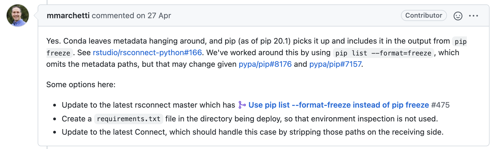

Python 中的库（package）可以分为标准库和三方库，标注库是在安装Python后，默认安装的库，如math，json等。其余的库可以称之为三方库，需要在使用前单独安装。我们经常使用到 `pip install <package>` 这个命令就是用于安装三方库的。这里我们只需要指定包名即可非常简单的实现三方库的安装。那么包存储在什么地方，我们是从何处下载安装的呢？

## PyPi

**Pip install** 命令支持四种来源的安装：

- PyPI (and other indexes) 
- VCS 
- 本地项目目录
- 本地/远程 的 archives 

> Python 安装包教程：https://packaging.python.org/tutorials/installing-packages/#installing-packages

首先，我们介绍下什么是PyPi。PyPi 是**The Python Package Index** 的缩写，是Python社区用来开发和共享软件的一种软件仓库。

一般如果在使用 pip 安装、搜索第三方Python库的时候，默认使用 Pypi源，若是希望使用其余（私有）的源，可以通过 `-i/--index-url`指定。

```bash
-i, --index-url <url>      Base URL of the Python Package Index (default https://pypi.org/simple). This should point to a repository compliant with PEP 503 (the simple repository API) or a local directory laid out in the same format.
```

如经常使用 [清华Pypi镜像](https://www.baidu.com/link?url=RbnqA8Pzgm1VYr2kd4nVOUmJAHvB7FMKfhNpvb-7NECkroQ2lnEeZarByMdEDrjA&wd=&eqid=93e5e4150001bb1b000000036190f15a) 加速某些包下载时经常使用如下方式

```bash
pip install -i https://pypi.tuna.tsinghua.edu.cn/simple/ <package>
```

## 项目结构

当一个Python项目要开源发布时，一般要符合某些目录结构，以常用的开源库  [twine](https://github.com/pypa/twine)  为例，可以看到 twine 的核心代码放在以包名命名的文件夹内，初次之外还多了README.rst 用于描述项目的文档，setup.cfg（有时为 setup.py）用于项目的打包，以及 test 作为测试或示例文件夹。

```
.
└── twine
    ├── __init__.py
    ├── __main__.py
    ├── auth.py
    ├── cli.py
    ├── commands
    ├── exceptions.py
    ├── package.py
    ├── py.typed
    ├── repository.py
    ├── settings.py
    ├── utils.py
    ├── wheel.py
    └── wininst.py
├── AUTHORS  # 作者
├── LICENSE  # LICENSE
├── README.rst  # 说明文档 
├── setup.cfg # setup 文件，用于打包
└── tests # 测试目录
```


## 打包Python库

### 编写Setup文件

setup 文件是 setuptools 的构建脚本，用来定义库的元信息（metadata），如包名，版本号，描述信息，依赖，入口方式等。

配置setup文件可以通过两种方式，一种是静态方式，即编写 setup.cfg 文件实现，第二种是动态方式，即编写 setup.py实现。这里的动态指的是一些参数只有在安装时才能确定。

> Python 官方建议使用 setup.cfg 方式定义，setup.py 将会被高版本的 setuptools 和 pip 所忽略。

下面看一个官方示例

 ```python
 import setuptools
 
 with open("README.md", "r", encoding="utf-8") as fh:
     long_description = fh.read()
 
 setuptools.setup(
     name="example-pkg-YOUR-USERNAME-HERE", # 包名
     version="0.0.1", # 版本号
     author="Example Author", # 作者信息
     author_email="author@example.com", # 邮箱
     description="A small example package", # 库的短描述
     long_description=long_description,
     long_description_content_type="text/markdown",
     url="https://github.com/pypa/sampleproject",
     project_urls={
         "Bug Tracker": "https://github.com/pypa/sampleproject/issues",
     },
     classifiers=[
         "Programming Language :: Python :: 3",
         "License :: OSI Approved :: MIT License",
         "Operating System :: OS Independent",
     ],
     package_dir={"": "src"},
     packages=setuptools.find_packages(where="src"),
     python_requires=">=3.6",
 )
 ```

下面对一些基础的参数进行介绍。

**Meta信息**

- name、version 项目包名、版本号等

- description 对库的**短描述**，当使用 pip search 搜索时会展示项目的**短描述**。

  ```bash
  $ pip search <package> # pip search 搜索时会使用 description 描述包
  mesotool (0.1.0)  - A Python Script For Sending Labeling.
  ```

- long_description 对库的**长描述**，当使用 `-h` 的时候，会展示项目的**长描述**。

  ```bash
  $ mesotool -h
  ...
  MesoTool command help create template and tasks by config file
  ...
  ```

**PyPi页面描述信息**

- url 项目本身地址，如 gitlab、github 地址。
- project_urls 项目中涉及到的外部地址，如文档地址，官网地址等
- classifiers 项目的索引，如Python版本分类等

**包执行与依赖相关**

- package_dir 包名和对应的目录地址。
- packages 列举项目中需要导出的包，可以使用 `setuptools.find_packages()`自动发现。
- python_requires 项目支持的Python版本，pip 在安装包时，会自动寻找合适当前版本Python的包

- entry_points 能在包安装时，自动生成一个自定的命令。

  通过如下方式，可以生成一个名为sample的命令，这个命令调用的是包sample下的main文件自评为入口。

  ```
  entry_points={
      'console_scripts': [
          'sample=sample:main',
      ],
  },
  ```

- Install_requires 该配置非常重要，它约定了该项目最小依赖，在pip 安装时，若是本地未安装的话，会自动从 pip 仓库中下载。

  ```
  install_requires=["pyyaml >= 6.0"]
  ```

> 更多 setup.py 文件的配置需要参考 [Packaging and distributing projects](https://packaging.python.org/guides/distributing-packages-using-setuptools/#entry-points) 

## 打包项目

第一步，需要确保有 setuptools 和 wheel 包

```bash
$ python3 -m pip install --upgrade setuptools wheel
```

第二步，使用sdist构建源码

```bash
$ python setup.py sdist bdist_wheel
```

上述命令会创建两个文件

- *.tar.gz 原始文件文档，在被pip安装时，还需要执行 build 步骤。
- *.whl 文件，wheel 文件是二进制可分发的文件，目前已被pip支持，可以直接通过pip 安装。

## 上传至私有仓库

上传至PyPi的文章很多了，本项目使用的是 Artifactory 作为私有仓库，不过也大同小异。比较简单的方式就是通过 `twine` 库上传至仓库。

```bash
$ twine upload -u <username> -p <password> -r <repo name> --repository-url <artifactory 地址> dist/*
```

## 模板

打包上传任务在任何一个开源项目中都有，可以参考 [twine](https://github.com/pypa/twine)、[requests](https://github.com/psf/requests) 等有名的三方库。

此外，还有一个高达 5k star 的项目 https://github.com/navdeep-G/setup.py 可以作为我们写 setup.py 的模板，它写了一个 UploadCommand 类，帮助我们一键完成打包&上传的工作。

## Q&A

### 如何生成 requirements.txt 文件

> 参考：https://stackoverflow.com/questions/62885911/pip-freeze-creates-some-weird-path-instead-of-the-package-version

最常用生成 requirements.txt 的方式是

```bash
$ pip freeze > requirements
```

这种生成方式少了一个使用的前提，就是需要配合 `pipenv` 一起使用，若是使用 Conda + Pip freeze 使用的话，生成的requirements.txt   文件中会包含一些  [direct references](https://www.python.org/dev/peps/pep-0440/#direct-references)。

```bash
cffi @ file:///opt/concourse/worker/volumes/live/6ed3f91b-28f6-4d58-6a9b-7a5e864c6554/volume/cffi_1625814710543/work
charset-normalizer @ file:///tmp/build/80754af9/charset-normalizer_1630003229654/work
cryptography @ file:///opt/concourse/worker/volumes/live/806790c7-13c6-41bc-7395-be030ef629d2/volume/cryptography_1616769285001/work
idna @ file:///tmp/build/80754af9/idna_1622654382723/work
pycparser @ file:///tmp/build/80754af9/pycparser_1594388511720/work
pyOpenSSL @ file:///tmp/build/80754af9/pyopenssl_1608057966937/work
requests @ file:///tmp/build/80754af9/requests_1629994808627/work
six @ file:///tmp/build/80754af9/six_1623709665295/work
```

这里因为 Conda 中的包信息为 metadata，pip freeze 在输出的时候，会以 Direct References 的方式输出。

> 参考：[Python requirements.txt file on Windows includes local file paths #494](https://github.com/rstudio/rsconnect/issues/494)



更推荐的做法为 

```bash 
$ pip list --format=freeze > requirements
```

或者对于Conda 用户

```bash
$ conda list --export > requirements
```

### 为什么会出现依赖找不到的情况

在私有库中生成的包，通过 pip 安装时，容易出现依赖的包寻找不到的问题。原因是当`install_requires`中的包找不到时，会从默认的仓库，即 **index-url**  查找，这里的 **index-url** 就是我们私有仓库的地址，当然找不到。这时候就需要借助 `--extra-index-url`来补充

```bash
$ pip install --index-url <artifactory link> --extra-index-url=https://pypi.org/simple/ <package name>
```

## 参考

- [Packaging and distributing projects](https://packaging.python.org/guides/distributing-packages-using-setuptools/#packaging-and-distributing-projects) 
