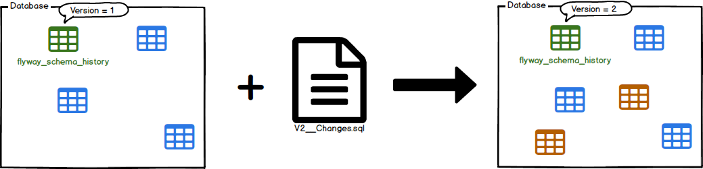

在软件开发和线上维护的工作中，通过 `Git` 工具可以轻松实现对代码的跟踪维护。与代码相对于的是，数据库的结构也会发生变动。那有没有类似的工具去管理呢？怀着这个问题，我去搜集到了以下三个工具可以用来进行数据库的迁移。

- django
- flayway
- dbmate

<!--more-->

## 为什么使用数据迁移

在程序开发过程中，数据库经常容易变动（如建表，修改字段等），此时面对不同环境上的数据库如何实现同步，保证数据库的一致性就比较困难。数据库迁移工具不仅仅完成数据库的搭建，还通过版本管理（Version Control）对数据库的状态进行管理，保证了不同环境中的数据库的状态相同。

## 版本管理

可以简单理解，迁移文件+ 版本数据库 = 数据库的版本管理。

### 迁移文件

迁移文件的版本管理，在本地就是管理一系列从建表开始至今的所有SQL指令。

一般对于迁移文件的命令核心就是要体现顺序性，在django 中是通过 **自增序号** 实现，dbmate 中使用 **时间戳** 来实现，而flyway的做法是 **约定脚本命名规则** ，下面具体分析。

#### flyway 命名规则

命名规则由：Prefix + Version + Separator + Description + .sql 构成

- Prefix：flyway 文件类型
  flyway 将迁移分为三种类型：普通迁移（Versioned Migrations）、撤销迁移（Undo Migrations）、重复迁移（Repeatable Migrations）

- Version：版本号
- Separator：双下划线 `__`
- Description：迁移内容描述，如 `create_tables`


### 迁移数据库

> 一般数据库迁移工具的核心就是维护一张数据库迁移表 `scheme_migrations` 。

这里以 `flyway` 为例，表 `flyway_schema_history` 就是 `flyway` 的迁移状态表。


从表中可以发现，其维护的 `迁移脚本名称`，`版本号`，`哈希校验值`，`创建时间`，`是否运行成功`等信息。

同时，可以通过运行 `flyway info` 命令查看数据库状态

```bash
$ ./flyway info
Flyway Community Edition 7.10.0 by Redgate
Database: jdbc:mysql://127.0.0.1:4001/test (MySQL 5.7)
Schema version: 3

+-----------+---------+---------------------+------+---------------------+---------+
| Category  | Version | Description         | Type | Installed On        | State   |
+-----------+---------+---------------------+------+---------------------+---------+
| Versioned | 1       | Create person table | SQL  | 2021-06-23 16:02:14 | Success |
| Versioned | 2       | Create person table | SQL  | 2021-06-23 16:02:14 | Success |
| Versioned | 3       | Add person          | SQL  | 2021-06-23 16:02:15 | Success |
+-----------+---------+---------------------+------+---------------------+---------+
```

### 基本功能

####  Migration

迁移任务会扫描指定文件夹下的 `迁移脚本`，并通过 `脚本文件名` 与 `迁移数据库` 进行比较，如果发现存在未迁移的文件，就会依次完成迁移任务，如所有脚本都已完成迁移，则不做任何操作。



#### Clean

Clean相对比较容易理解，即清除掉对应数据库Schema中的所有对象，包括表结构，视图，存储过程，函数以及所有的数据等都会被清除。


#### Info

Info用于打印所有Migrations的详细和状态信息，其实也是通过Metadata表和Migrations完成的，下图很好地示意了Info打印出来的信息。


#### Validate

flayway 的验证功能是其余工具没有的，这类功能和 `Git` 中的哈希值一样，通过对每个迁移脚本生成 `CheckSum` 值，用于检查脚本是否发生了变化。


## 迁移工具的比较

- [django](https://github.com/django/django) **[58.2k stars]**

  django 是基于Python开发的后端框架，一般不被用于数据库的迁移工具，但是django 自带的数据库迁移工具表现非常优异。

- [flyway](https://github.com/flyway/flyway) **[5.9k stars]**

  flyway 是基于 Java 开发的数据库迁移工具，flyway 的文档和教程非常优秀，本文的很多知识借鉴于此

- [dbmate](https://github.com/amacneil/dbmate) **[1.9k stars]**

  dbmate 是基于Go开发的轻量级的数据库迁移工具，非常简洁方便。

|        | django                                                       | flyway                           | dbmate   |
| ------ | ------------------------------------------------------------ | -------------------------------- | -------- |
| free   | ✅                                                            | undo 收费                        | ✅        |
| ablity | ⭐️                                                            | ⭐️⭐️⭐️                              | ⭐️⭐️       |
| 优点   | 每次**模型**变动，自动生成迁移文件。                         | 功能最为强大                     | 简洁     |
| 缺点   | 需利用Django的ORM工具<br />无法生成和数据库一致的DDL。<br />如：缺少TimeStamp类型、<br />缺少默认值设置 | 1. undo功能收费<br />2. java工具 | 功能简单 |

命令对照：

| 功能             | django            | flyway          | dbmate        |
| ---------------- | ----------------- | --------------- | ------------- |
| 自动生成迁移文件 | makemigrations    | --              | --            |
| 迁移             | migrate           | flyway migrate  | dbmate up     |
| 回滚             | migrate [version] | flyway undo     | dbmate down   |
| 清空             | flush             | Flyway clean    | dbmate drop   |
| 状态             | showmigrations    | flyway info     | Dbmate status |
| 验证             | --                | flyway validate | --            |

## 总结

通过比较了三种数据库迁移工具，发现了各有特点。对于简单项目，需求不高，可以使用dbmate，对于成熟且复杂的项目，可以考虑使用flyway，django 虽然很好使用，是三者里面唯一不需要写SQL脚本的，但是它与 `django` 绑定较深，而且无法完美支持原生的SQL，故不建议使用。

## 参考资料

- https://blog.waterstrong.me/flyway-in-practice/
- https://flywaydb.org/documentation/concepts/migrations
- https://docs.djangoproject.com/zh-hans/3.2/topics/migrations/

