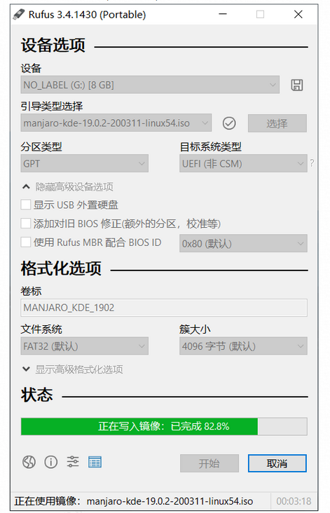

家中闲置了一台电脑，准备用来当做服务器。一方面也是作为linux 学习练练手，二是可以运行一些爬虫小程序或者是网页服务。

这里我用的manjaro，这是目前比较流行的linux 发行版，最热门的linux桌面发行版之一。

我选择manjaro也是想作为替代windows 来用。manjaro拥有一个非常方便的软件仓库，利用pacman和yay等命令可以十分方便的安装软件。
Manjaro 是一款基于Arch Linux的操作系统，它是目前Linux众多发行版中对用户非常友好的操作系统，它拥有非常好看的桌面环境（KDE，GNOME），支持滚动发布，一条命令即可安装软件等总多优秀的特点。Manjaro可以让你体验到如Windows，Mac一样的使用体验。

更多的介绍可以参考：

[Manjaro Linux 乐于简单](https://manjaro.org.cn/)

<!--more-->

## 系统安装

- [Manjaro Linux 入门使用教程](https://segmentfault.com/a/1190000041023208)
- [2021【保姆级教程】Win+Manjaro双系统双硬盘安装](https://zhuanlan.zhihu.com/p/376787855)

### 1.镜像下载

镜像下载：建议去[Manjaro官方网站](https://www.manjaro.org/download/)下载，目前官方的主题有Plasma(KDE)，Xfce和Gome。三种都用过，都差不多，感觉KDE最精美，Xfce最轻量，Gnome比较新潮。我现在用的是Gnome。

### 2.启动盘制作

这里使用的是Rufus，操作非常简单。



### 3.安装

可以参考：[Manjaro Linux安装教程(极致linux原创)](https://linuxacme.cn/99)

其给出的分区方案为：

| 大小/分配  | /根分区 | /home分区 | swap分区 | EFI引导分区 |
| ---------- | ------- | --------- | -------- | ----------- |
| 新分区<80G | 所有    | 无        | 2GB      | 300MB       |
| 新分区128G | 60GB    | 60GB      | 4GB      | 1GB         |
| 新分区256G | 80GB    | 160GB     | 8GB      | 1GB         |
| 新分区512G | 150GB   | 340GB     | 16GB     | 1GB         |

## 配置

### 1.更换软件源

```
sudo pacman -Syy
sudo pacman-mirrors -i -c China -m rank  #选一个阿里源就行
```

增加中文社区的源

可以编辑`/etc/pacman.conf`

```
# sudo vi /etc/pacman.conf
[archlinuxcn]
SigLevel = Optional TrustedOnly
Server = https://mirrors.ustc.edu.cn/archlinuxcn/$arch
```

或直接使用命令行修改

```
sudo sed -i '$a\[archlinuxcn]\nServer = https://mirrors.ustc.edu.cn/archlinuxcn/$arch'  /etc/pacman.conf
```

添加完了之后更新

```
sudo pacman -Sy archlinuxcn-keyring
```

## 安装软件

首先，第一步，先安装`AUR 包管理工具(yay)`，我们之后需要用到它来安装软件

软件安装命令如下：

```
sudo pacman -S yay # Arch Linux AUR 包管理工具
```

### 软件列表

```
# vim
sudo pacman -S vim

# chrome
sudo pacman -S google-chrome
yay -S google-chrome
```

## 软件管理

```
sudo pacman -S package_name # install
sudo pacman -R package_name # remove
sudo pacman -Rs package_name # 卸载软件＋不需要的依赖
```

## 其他命令

```
screenfetch # 查看系统信息
```

## 缺点与不足

Manjaro 陪伴了我一段时间，最终我放弃将其作为家用服务器的操作系统选择，原因是其作为一款桌面操作系统很不错，但是作为一款服务器操作系统稍有不足，很多软件并未对其适配，使得在安装时碰到了很多问题难以解决。
