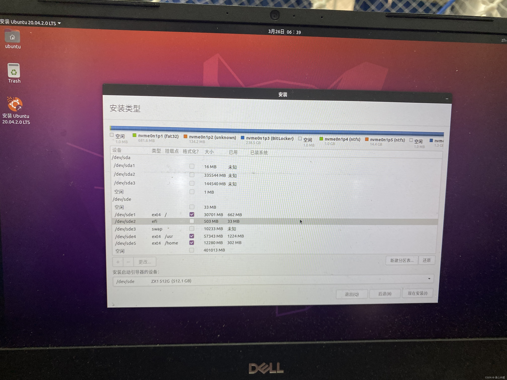

如上文所述，在Manjaro上遇到一些难以解决的问题后，我选择了一个兼具桌面管理环境与无图行的操作系统————`Ubuntu`
Ubuntu 是一款基于Debian的操作系统，它是一款经典受欢迎的操作系统，不过多介绍。

<!--more-->

## 系统安装

### 1.镜像下载

镜像下载：建议去[Ubuntu官网](https://www.ubuntu.org.cn/global)下载，镜像选择上，可以选择经典的16.04LTS，我这次没有选择最新的版本，而是选择了20.04.4 LTS

### 2.启动盘制作

- UltralSO

  [使用U盘制作Ubuntu系统启动盘](https://zhuanlan.zhihu.com/p/378668860)

- Rufus

  [在U盘下安装ubuntu20.04，从U盘启动Linux系统](https://blog.csdn.net/qq_51491920/article/details/123668279)

### 3.安装

分区方案：

- [【个人笔记】Ubuntu分区方案](https://blog.csdn.net/qq_42751676/article/details/120850185)

  ```
  /boot 主分区 512M
  /swap 主分区 16G
  /     主分区 133G     
  ```

- [在U盘下安装ubuntu20.04，从U盘启动Linux系统](https://blog.csdn.net/qq_51491920/article/details/123668279)

  

## 其他

### 合盖不休眠

>  [Don't suspend when lid is closed, just lock screen](https://askubuntu.com/questions/972169/ubuntu-17-10-and-later-dont-suspend-when-lid-is-closed-just-lock-screen)

```
sudo apt-get install gnome-tweak-tool
# Launch Tweaks -> Power(or General) -> disable suspend on lid-close
```

