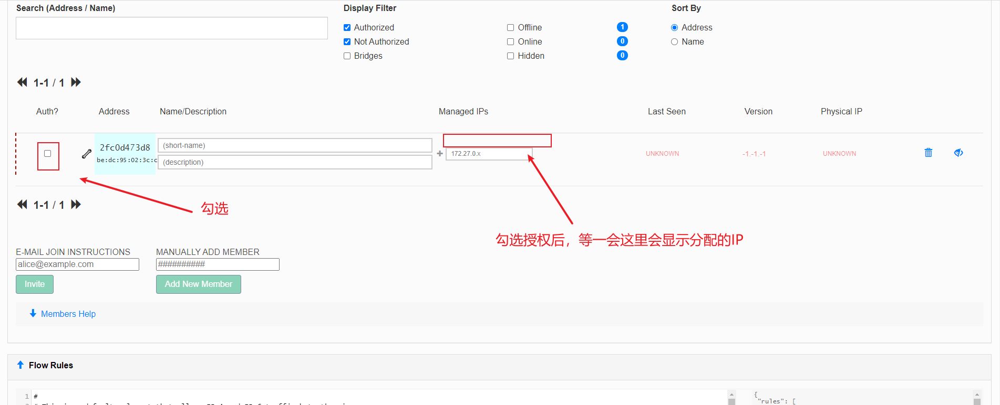
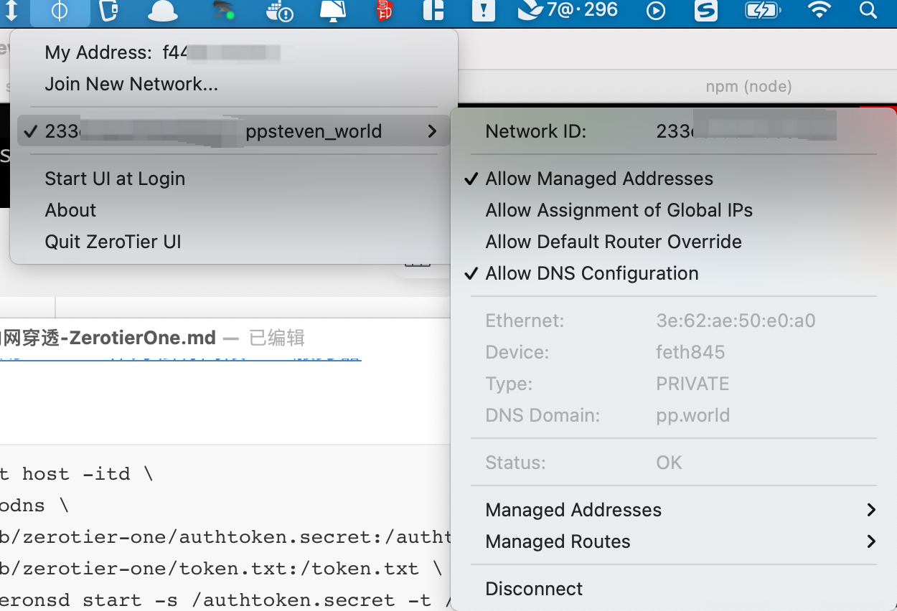

内网穿透是把家用服务器改造成网络服务器的重要一步

目前成熟的解决方案有

- 申请公网IP：需要联系网络服务商，困难
- 花生壳
- frp
- ngork
- zerotier

zerotier和上述方式本质的区别是，它是一个组网工具，目的是将数台已有的设备组合成一个大型的局域网。

<!--more-->

## 安装

软件下载：[地址](https://www.zerotier.com/download/)

mac 推荐安装其带的桌面端工具

Linux推荐使用docker安装

## 初级使用

### 基础命令

```
sudo zerotier-cli join 233ccaac27xxxxx # 加入网络
200 join OK
sudo zerotier-cli info # 查看是否连入网络
# 200 info 07bf052a5a 1.10.1 ONLINE
sudo zerotier-cli leave 233ccaac27xxxxx # 断开网络	
```

### 后台管理

只要知道网络的ID，即`233ccaac27xxxxx`,任何设备都可以连入该网络，但是只有在后台通过的设备才能真正加入



除了简单的运行接入设备以外，还可以

- 管理连入设备的名称
- 为每台设备分配ip
- 邀请设备加入

### 高级使用-DNS服务器

设备一旦多起来，使用IP无法记住所有的设备，所以需要一台局域网的DNS服务器建立域名，zeronsd就是起到这样的作用。

> [zerotier进阶 使用zeronsd作为私有网段DNS服务器](https://www.pudn.com/news/62833b7c9b6e2b6d55d678b9.html)

**容器启动服务**

```
docker run --net host -itd \
     --name zerodns \
     -v /var/lib/zerotier-one/authtoken.secret:/authtoken.secret \
     -v /var/lib/zerotier-one/token.txt:/token.txt \
     zerotier/zeronsd start -s /authtoken.secret -t /token.txt  -w -d 替换为你的域名 替换为你的ID
```

**说明**

- authtoken.secret 

  它决定了zerodns连接的网络，zerodns运行时必须已经加入了网络中，一般位于`/var/lib/zerotier-one/`下，取决于安装的方式。

- token.txt 

  生成token时秘钥文件，生成完后就消失，需要保持下来。

**最后**

所有加入的设备需要使用DNS前，需要重新加入网络，并勾选DNS选项。



服务端最好也是重新加入一下网络，并重新启动下`zeronsd`

```
sudo zerotier-cli leave 233ccaac27xxxxx # 离开
sudo zerotier-cli join 233ccaac27xxxxx # 加入
docker restart zerodns # 重新启动zeronsd
```

## 参考

- [组网神器Zerotier One使用](http://t.zoukankan.com/steinven-p-15220959.html)

