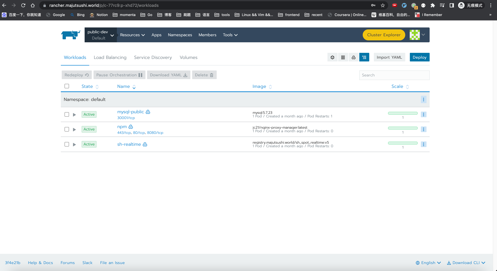

Rancher是一个开源的企业级容器管理平台。通过Rancher，企业再也不必自己使用一系列的开源软件去从头搭建容器服务平台。Rancher提供了在生产环境中使用的管理Docker和Kubernetes的全栈化容器部署与管理平台。
<!--more-->
## 安装

Rancher 基于Docker安装非常方便

### 创建目录
创建文件夹用以挂载`配置文件`和`数据文件`
```
mkdir -p docker-data/rancher/{config, auditlog}
```

目录结构如下
```
docker-data/
├── alist
│   ├── config.json
│   ├── data.db
│   └── temp
├── docker-registery
│   └── docker
├── docker-registry
├── mysql
│   ├── conf
│   └── data
├── mysql5.7.23
│   ├── auto.cnf
│   ├── ca-key.pem
│   ├── ca.pem
│   ├── client-cert.pem
│   ├── client-key.pem
│   ├── db
│   ├── ib_buffer_pool
│   ├── ibdata1
│   ├── ib_logfile0
│   ├── ib_logfile1
│   ├── ibtmp1
│   ├── mysql
│   ├── performance_schema
│   ├── private_key.pem
│   ├── public_key.pem
│   ├── server-cert.pem
│   ├── server-key.pem
│   └── sys
├── nginx
│   ├── conf
│   ├── html
│   ├── logs
│   └── ssl
├── portainer_data
│   ├── backups
│   ├── bin
│   ├── certs
│   ├── compose
│   ├── config.json
│   ├── docker_config
│   ├── portainer.db
│   ├── portainer.key
│   ├── portainer.pub
│   └── tls
├── postgresql [error opening dir]
└── rancher
    ├── auditlog # 新建
    └── config # 新建
```

### 运行容器
```bash
docker run -d --privileged  \
   --restart=unless-stopped  \
   --name rancher2.5 -p 8080:80 -p 8443:443 \
   -v ~/docker-data/rancher/config:/var/lib/rancher \
   -v ~/docker-data/rancher/auditlog:/var/log/auditlog \
   rancher/rancher:v2.5-head
```

## 成品展示



## 后记
安装`Rancher`并没有想象中一帆风顺，在安装过程中碰到一系列问题，如 Rancher 无法在`Manjaro`系统上成功安装，更换`Ubuntu`后才解决。

在同一台机器上同时安装 `rancher` 和 `rancher-agent` 会遇到一些问题。特别是希望通过异地组网的方式将不同无公网的设备组合在一起，并使用局域网域名管理的时候，遇到了一系列网络的问题。

最后使用的解决方案是，在家用服务器安装rancher-server，将带公网IP的服务器作为`rancher-agent`，好处是在安装失败后可以直接重装系统清理环境。

## 更多资料：
- [Installing Rancher on a Single Node Using Docker](https://rancher.com/docs/rancher/v2.6/en/installation/other-installation-methods/single-node-docker/)
- [安装Rancher并使用SSL](https://rancher.com/docs/rancher/v1.6/zh/installing-rancher/installing-server/basic-ssl-config/#rancherssl)
