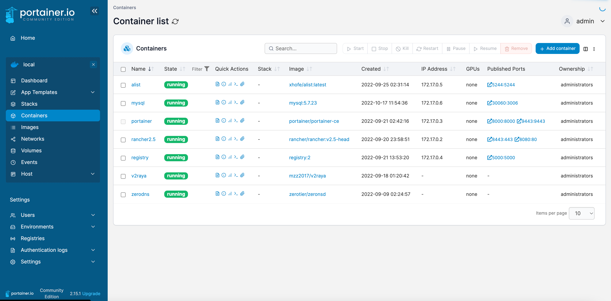

继上文提及的K8S容器管理平台，Portainer是一个适合本地部署的轻量化的Docker可视化管理平台，可以让你轻松地管理你的Docker容器。

Portainer 使用非常简单，可以让你摆脱记忆复制的Docker命令
<!--more-->
## 安装

### 创建目录
创建文件夹用以挂载`配置文件`和`数据文件`
```
mkdir -p ${HOME}/docker-data/portainer_data
```

目录结构如下
```
docker-data/
├── alist
│   ├── config.json
│   ├── data.db
│   └── temp
├── docker-registery
│   └── docker
├── docker-registry
├── mysql
│   ├── conf
│   └── data
├── mysql5.7.23
│   ├── auto.cnf
│   ├── ca-key.pem
│   ├── ca.pem
│   ├── client-cert.pem
│   ├── client-key.pem
│   ├── db
│   ├── ib_buffer_pool
│   ├── ibdata1
│   ├── ib_logfile0
│   ├── ib_logfile1
│   ├── ibtmp1
│   ├── mysql
│   ├── performance_schema
│   ├── private_key.pem
│   ├── public_key.pem
│   ├── server-cert.pem
│   ├── server-key.pem
│   └── sys
├── nginx
│   ├── conf
│   ├── html
│   ├── logs
│   └── ssl
├── portainer_data
│   ├── backups
│   ├── bin
│   ├── certs
│   ├── compose
│   ├── config.json
│   ├── docker_config
│   ├── portainer.db
│   ├── portainer.key
│   ├── portainer.pub
│   └── tls
├── postgresql [error opening dir]
└── rancher
    ├── auditlog # 新建
    └── config # 新建
```

### 运行容器
```bash
docker run -d -p 8000:8000 -p 9443:9443 \
  --name portainer --restart=always \
  -v /var/run/docker.sock:/var/run/docker.sock  \
  -v ${HOME}/docker-data/portainer_data:/data \
  portainer/portainer-ce
```

## 成品展示



### 使用体验

Portainer 可以直观的使用可视化面板创建Docker容器，与使用命令行一致。但是可以大大帮助我们减低docker命令的记忆量。而且对于像`docker inspect`此类的操作来说，在页面上查看信息和复制信息相较`命令行`也更为方便。


## 更多资料：
- [Install Portainer with Docker on Linux](https://docs.portainer.io/start/install/server/docker/linux)
- [【Docker系列】Docker可视化面板——Portainer](https://blog.laoda.de/archives/portainer)