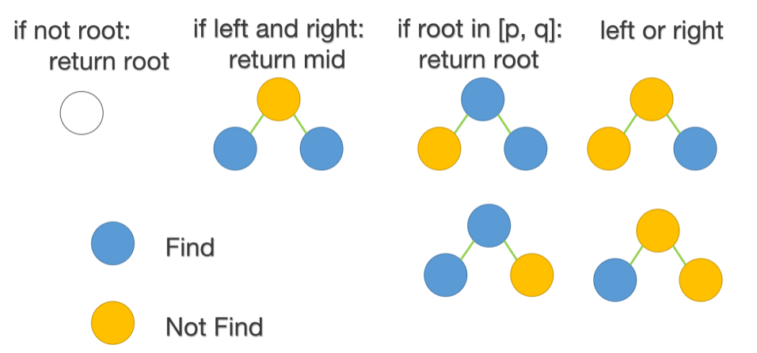

## Python示例

**哈希表记录**

```python
class Solution:
    def lowestCommonAncestor(self, root: 'TreeNode', p: 'TreeNode', q: 'TreeNode') -> 'TreeNode':
        def preorder(root):
            if not root: return root
            if root.left: # 先序遍历记录每个节点的父节点
                father[root.left] = root
            if root.right:
                father[root.right] = root 
            preorder(root.left)
            preorder(root.right)
        father = {}
        father[root] = None 
        preorder(root)

        visited = set()
        while p: # 不断的寻找 p 的父节点，直到走到根节点
            visited.add(p)
            p = father[p]
        while q:
            if q in visited:
                return q
            q = father[q]
```

**递归法**



```python
class Solution:
    def lowestCommonAncestor(self, root: 'TreeNode', p: 'TreeNode', q: 'TreeNode') -> 'TreeNode':
        def preorder(root):
            if not root: return root # 1. 空节点
            if root in [p, q]: return root  # 2. 找到节点，直接返回
            left = preorder(root.left) 
            right = preorder(root.right)
            if left and right: # 3. 如果分别在左右子树上，那一定根节点是公共祖先
                return root 
            return left or right # 4. 一定是左节点或右节点上
        return preorder(root)
```

