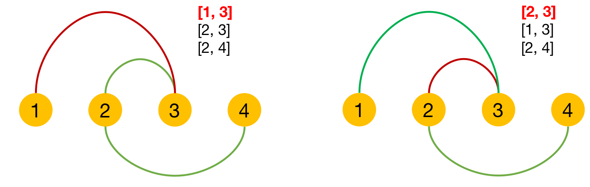

## 题目描述

给定多个区间，计算在保证区间互相不重叠的情况下所需移除的最小区间个数，起止相连不算重叠

## 样例

```
Input: [ [1,2], [2,3], [3,4], [1,3] ]
Output: 1
# 解释：移除 [1,3] 后，剩下的区间没有重叠。
```

## 题解

选择保留区间的时候，贪心策略认为当区间结尾越小，留给其他区间的空间就越大。因此，保留结尾小且不重叠的区间

第一步：按照区间结尾节点排序，选择排序后的第一个节点为第一个要保留节点

第二步：依次遍历，移除交叉的节点，移除个数加一。

**编程注意点：**

1.如何自定义排序？

```python
# python
arr.sort(key=lambda x: x[1])
```

```cpp
// cpp
sort(a.begin(), a.end(), [](vector<int> a, vector<int>b) {
   return a[1] < b[1]
});
```

```go
// go 
sort.Ints([]int{})
sort.Strings([]string{})
sort.Slice(s, func(i,j int) bool {return s[i]<s[j]})

// 第一个元素正排，第二个元素倒排
sort.Slice(nums, func(i, j int) bool {
  if nums[i][0] == nums[j][0] {
    return nums[i][1] > nums[j][1] // 倒排
  }
  return nums[i][0] < nums[j][0] // 正排
})

// 按第二个元素排序
sort.Slice(s, func(i, j int) bool {
  return s[i][1] < s[j][1] 
})
```


2.如何确定是否交叉？

为了比较是否重叠，原先是要相互比较两个区间的首尾才能得出。由于排序保证了结尾一定是增量的。故只要比较区间头部的大小。

```python
# A区间:[0, 2] B区间:[1,3]
true if B[0] < A[1] else false
```

3.如果结尾一样，但是开头不一样会影响结论吗？

从以下例子看出是不影响的



## 代码示例

Python 示例

```python
class Solution:
    def eraseOverlapIntervals(self, intervals: List[List[int]]) -> int:
        if not intervals: return 0
        intervals.sort(key=lambda x: x[1])
        removed = 0
        end = intervals[0][1]
        for i in range(1, len(intervals)):
            if intervals[i][0] < end: # 交叉区间移除
                removed += 1
            else:
                end = intervals[i][1] # 加入新的区间，并更新结尾
        return removed
```

Go 示例

```go
func eraseOverlapIntervals(intervals [][]int) int {
    n := len(intervals)
    if n < 1 { return 0 }
    sort.Slice(intervals, func (i, j int) bool {
        return intervals[i][1] < intervals[j][1]
    })
    removed := 0
    end := intervals[0][1]
    for i := 1; i < n; i++ {
        if intervals[i][0] < end {
            removed++
        } else {
            end = intervals[i][1]
        }
    }
    return removed
}
```

