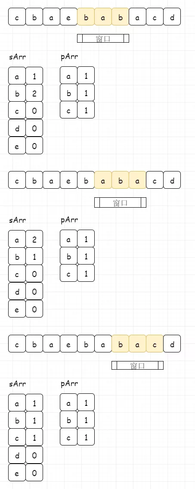

## 题目描述

给定一个字符串 **s** 和一个非空字符串 **p**，找到 **s** 中所有是 **p** 的字母异位词的子串，返回这些子串的起始索引。

## 样例

```
Input: s: "cbaebabacd" p: "abc"
Output: [0, 6]

解释:
起始索引等于 0 的子串是 "cba", 它是 "abc" 的字母异位词。
起始索引等于 6 的子串是 "bac", 它是 "abc" 的字母异位词。
```

## 题解

> [图解](https://www.geekxh.com/1.5.%E6%BB%91%E5%8A%A8%E7%AA%97%E5%8F%A3%E7%B3%BB%E5%88%97/503.html#_02%E3%80%81%E9%A2%98%E8%A7%A3%E5%88%86%E6%9E%90)



## Python示例

```python
# 简单
class Solution:
    def findAnagrams(self, s: str, p: str) -> List[int]:
        if not s or len(s) < len(p): return []

        def is_same(arr1, arr2):
            # 验证是否相同
            for k in arr1.keys():
                if not arr1[k] == arr2[k]:
                    return False
            return True
				
        # 初始化比较数组
        sArr, pArr = {}, {}
        char = 'a';
        while char <= 'z':
            sArr[char] = 0
            pArr[char] = 0
            char = chr(ord(char) + 1)

        for char in p:
            pArr[char] += 1
        for idx in range(len(p)):
            sArr[s[idx]] += 1

        l, r = 0, len(p) - 1
        ans = []

        while r + 1 < len(s):
            if is_same(sArr, pArr):
                ans.append(l)
            # 整体右移
            r += 1
            sArr[s[r]] += 1
            sArr[s[l]] -= 1
            l += 1
        # 剩下最后一个元素
        if is_same(sArr, pArr):
            ans.append(l)
        return ans
        
```

```python
# Best Answer
class Solution:
    def findAnagrams(self, s: str, p: str) -> List[int]:
        sArr, pArr = {}, {} 
        char = 'a';
        while char <= 'z':
            sArr[char] = 0
            pArr[char] = 0
            char = chr(ord(char) + 1)
        for char in p:
            pArr[char] += 1
        
        # 滑动窗口
        l, r = 0, -1
        ans = []
        while r < len(s) - 1:
            r += 1
            sArr[s[r]] += 1
            
            while sArr[s[r]] > pArr[s[r]]: # 如果右移
                sArr[s[l]] -= 1 # 左移
                l += 1
            if r - l + 1 == len(p):
                ans.append(l)
        return ans
```