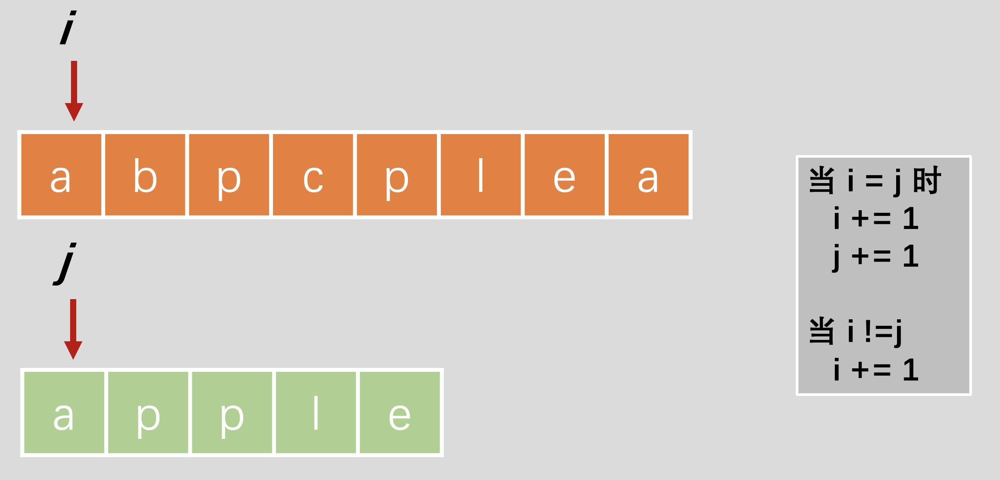

## 题目描述

给定一个字符串和一个字符串字典，找到字典里面最长的字符串，该字符串可以通过删除给定字符串的某些字符来得到。如果答案不止一个，返回长度最长且字典顺序最小的字符串。如果答案不存在，则返回空字符串。

## 样例

```
Input : s = "abpcplea", d = ["ale","apple","monkey","plea"]
Output: "apple"
```

## 题解

本题搜索的方法，可以使用 `查找函数` 限定查找的范围将 字符串找到。

不过，使用双指针搜索更有针对性的搜索



## Python 示例

```python
# 限定查找的范围
class Solution:
    def findLongestWord(self, s: str, d: List[str]) -> str:
        def findWord(word):
            pos = 0
            for char in word:
                pos = s.find(char, pos)
                if pos == -1:
                    return False 
                pos += 1
            return True 

        d.sort(key=lambda x: (-len(x), x))
        for word in d:
            if findWord(word):
                return word 
        return ''

      
# 双指针搜索
class Solution:
    def findLongestWord(self, s: str, d: List[str]) -> str:
        def findWord(word):
            i = j = 0 # i 指向 word，j 指向s，同向搜索
            while i < len(word) and j < len(s):
                if word[i] == s[j]:
                    i += 1
                    j += 1
                else:
                    j += 1
            return i == len(word) # 搜索到
        
        d.sort(key=lambda x: (-len(x), x))
        for word in d:
            if findWord(word):
                return word 
        return ''
```


