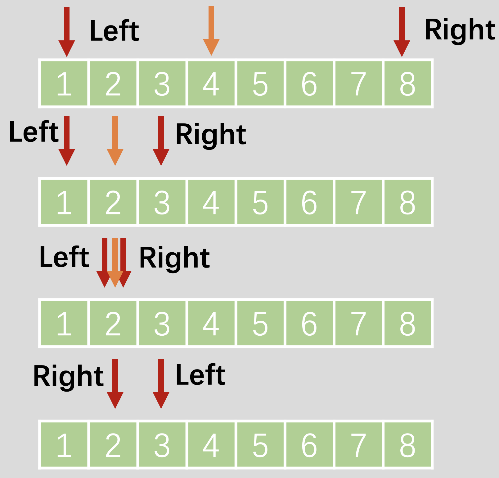

## 题目描述

实现 平方根函数 `sqrt`，只保留整数部分，向下取整。

## 样例

```
Input: 8
Output: 2
说明: 8 的平方根是 2.82842..., 
     由于返回类型是整数，小数部分将被舍去。
```

## 题解

使用二分查找，注意如果是向下取整，是取 `Right`  



## Python 示例

> 注意点，为了提升Python的效率，可以有如下几点优化

第一点、取中位数

高效做法是用 `left + (right - left) // 2` 替换 `(left + right) // 2`

第二点：为了避免造成 `mid ** 2 > x` 的数值越界，建议使用 `x // mid` 除法替代乘法

第三点：为了避免数值重复计算，使用 `sqrt = x // mid` 

```python
# 左闭右闭写法
class Solution:
    def mySqrt(self, x: int) -> int:
        if x == 0: return 0
        left, right = 1, x
        while left <= right:
            mid = left + (right - left) // 2
            sqrt = x // mid 
            if sqrt== mid:
                return mid 
            elif sqrt > mid:
                left = mid + 1
            else:
                right = mid - 1
        return right 

# 左闭右开写法-->查找元素靠左
class Solution:
    def mySqrt(self, x: int) -> int:
        if x == 0: return 0
        left, right = 1, x + 1
        while left < right:
            mid = left + (right - left) // 2 + 1
            sqrt = x // mid 
            if sqrt== mid:
                return mid 
            elif sqrt > mid:
                left = mid
            else:
                right = mid - 1
        return right 

# ans 记录写法
class Solution:
    def mySqrt(self, x: int) -> int:
        if x == 0: return 0
        left, right = 1, x
        ans = -1 
        while left <= right:
            mid = left + (right - left) // 2
            sqrt = x // mid 
            if sqrt >= mid: # sqrt大，代表mid小，向左取整
                ans = mid  
                left = mid + 1   
            else:
                right = mid - 1
        return ans  
```

