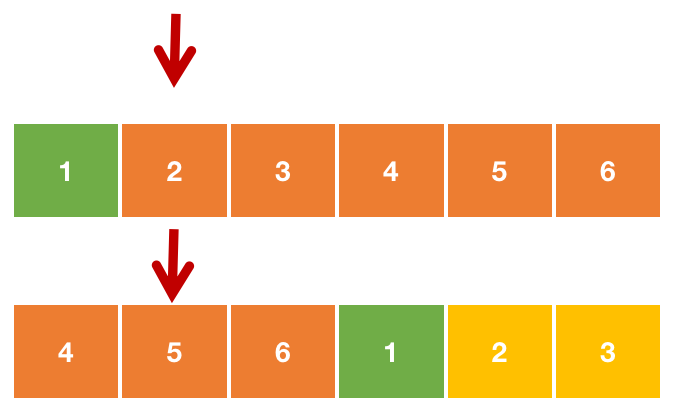

## 题目描述

找出在旋转排序数组中的最小值，本题中数组不存在重复值

## 样例

```
Input: [3,4,5,1,2]
Output: 1

Input: [4,5,6,7,0,1,2]
Output: 0
```

## 题解

左闭右开，寻找最小值。由于最小值一定是靠右的，所以我们应该使用左闭右开靠右的写法。

> 关键点在于确定mid 是落在哪一段?

这里一定要比较 num[mid] 和 num[right]。因为比较left的话，是无法区别最小值是在左边还是右边，下面就是例子。



这样我们的判断条件就有了

- nums[mid] < nums[right]：right = mid 
- nums[mid] >= nums[right]：left = mid + 1 

解题上，可以有两种思路去实现：

第一种，是寻找最小值，即靠右的二分查找

第二种，是寻找最大值，即靠左的二分查找。返回 `nums[(pos + 1) % len(nums)]`

## Python示例

```python
# 寻找最小值
class Solution:
    def findMin(self, nums: List[int]) -> int:
        left, right = 0, len(nums) - 1
        while left < right:
            mid = (left + right) >> 1
            if nums[mid] < nums[right]: # mid 有可能是最小值，不拒绝
                right = mid 
            else:
                left = mid + 1
        return nums[left]

# 寻找最大值
class Solution:
    def findMin(self, nums: List[int]) -> int:
        left, right = 0, len(nums) - 1
        while left < right:
            mid = (left + right) // 2 + 1
            if nums[mid] > nums[left]: # mid 有可能是最大值，不拒绝
                left = mid 
            else:
                right = mid - 1
        return nums[(left + 1) % len(nums)]
```

## Go 示例

```go
func findMin(nums []int) int {
    if len(nums) == 1 {
        return nums[0]
    }

    n := len(nums)
    if nums[0] < nums[n - 1] { // 有序
        return nums[0]
    }
    i, j:= 0, n - 1
    for i < j{
        mid := (i + j) >> 1
        if nums[mid] < nums[j] {
            j = mid 
        } else {
            i = mid + 1
        }
    }
    return nums[i]
}
```

