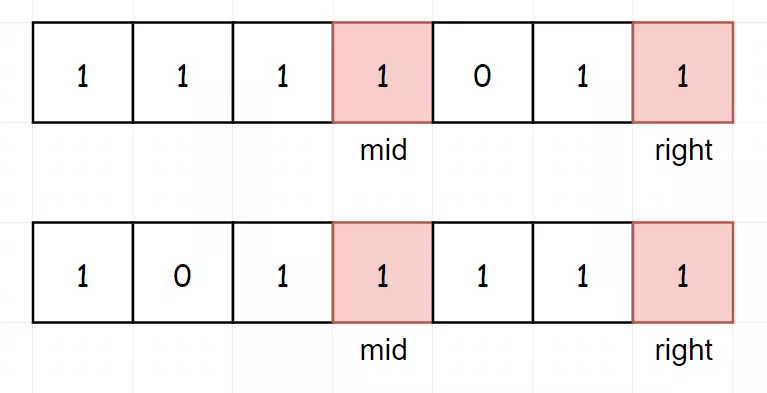

## 题目描述

找出在旋转排序数组中的最小值，本题中数组 **存在** 重复值

## 样例

```
Input: [3,4,5,1,2]
Output: 1

Input: [2,2,2,0,2]
Output: 0
```

## 题解

本题和 153 题目一样，但是由于存在重复值，我们无法仅仅通过比较就能确定最小值的位置。

特殊例子如下：0 在 mid 的左边或者右边都有可能



这里  **通常**  的做法就是将 `right -= 1` 左移，就可以打破这种情况

## Python 示例

```python
# 寻找最小值
class Solution:
    def findMin(self, nums: List[int]) -> int:
        left, right = 0, len(nums) - 1
        while left < right:
            mid = (left + right) >> 1
            if nums[mid] < nums[right]: # mid 有可能是最小值，不拒绝
                right = mid 
            elif nums[mid] > nums[right]:
                left = mid + 1
            else:
                right -= 1  # 注意，这一步在极端情况下，会从 O(log2(n)) 退化为 O(n)
        return nums[left]
```

