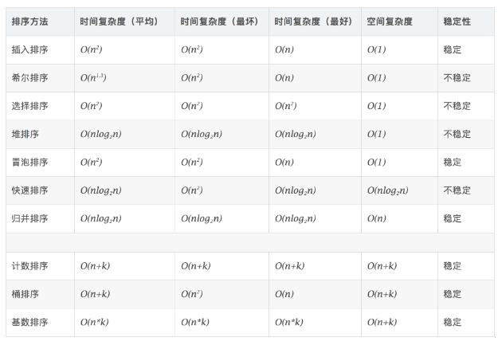

> 图解参考：

[十大算法图解](https://www.geekxh.com/2.0.%E6%8E%92%E5%BA%8F%E7%B3%BB%E5%88%97/0.hello.html#%E5%9F%BA%E6%9C%AC%E5%88%86%E7%B1%BB)

## 常用排序算法总结



## Ox1. 冒泡排序

```python
def bubble_sort(nums): 
    """ 沉石法 """
    for j in range(len(nums) - 1, 0, -1):
        for i in range(j):
            if nums[i] > nums[i+1]: nums[i], nums[i+1] = nums[i+1], nums[i]
        print(nums)

def bubble_sort_cs2(nums): 
    """ 沉石法 写法2"""
    for i in range(1, len(nums)):
        for j in range(0, len(nums) - i):
            if nums[j] > nums[j+1]:
                nums[j], nums[j+1] = nums[j+1], nums[j]
        print(nums)
```


## Ox2. 快速排序

```python
# 快速排序模板①
def quick_sort(nums, start, end):                                                                   
    if start >= end:
        return
    pivot = nums[start]  # 基准值
    low = start  # 左指针
    high = end  # 右指针
    while low < high:
        while low < high and nums[high] >= pivot:
            high -= 1
        nums[low] = nums[high]

        while low < high and nums[low] < pivot:
            low += 1
        nums[high] = nums[low]
    nums[low] = pivot
    quick_sort(nums, start, low - 1)
    quick_sort(nums, low + 1, end)

# 快速排序模板②
def quick_sort(nums, start, end):
    if start >= end:
        return 
    pivot = nums[start]
    left = start + 1
    right = end 
    while True:
       while left < end and nums[left] <= pivot:
           left += 1
       while right > start and nums[right] >= pivot:
           right -= 1
       if left >= right:
            break
       nums[left], nums[right] = nums[right], nums[left]
    nums[right], nums[start] = nums[start], nums[right]
    quick_sort(nums, start, right - 1)
    quick_sort(nums, right + 1, end)
```


## Ox3. 归并排序

```python
def merge_sort(nums):
    size = len(nums)
    if size < 2 : return nums
    mid = size >> 1
    left, right = merge_sort(nums[:mid]), merge_sort(nums[mid:])
    return merge(left, right)

def merge(left, right):
    l, r, result = 0, 0, []
    while l < len(left) and r < len(right):
        if left[l] <= right[r]:
            result.append(left[l])
            l += 1
        else:
            result.append(right[r])
            r += 1
    result += left[l:]
    result += right[r:]
    return result
```


## Ox4. 堆排序

### Python 实现堆排

**Python 自己实现堆排**

```python
#  调整堆,把最大值调整到堆顶
def adjust_heap(nums, i, size):
    lchild = 2 * i + 1
    rchild = 2 * i + 2
    largest = i
    if lchild < size and nums[lchild] > nums[largest]:
        largest = lchild
    if rchild < size and nums[rchild] > nums[largest]:
        largest = rchild
    if largest != i:
        nums[largest], nums[i] = nums[i], nums[largest]
        adjust_heap(nums, max, size)


# 创建堆
def build_heap(lists, size):
    for i in range(0, (size >> 1))[::-1]: # size // 2 是最后一个非叶子节点，
        adjust_heap(lists, i, size)


# 堆排序
def heap_sort(lists):
    size = len(lists)
    build_heap(lists, size)
    for i in range(0, size)[::-1]:
        lists[0], lists[i] = lists[i], lists[0]
        adjust_heap(lists, 0, i) # 此时只要调整 0 节点的数值即可
    return lists
```

**Python标准库 heapq**

```python
import heapq
from random import shuffle
class Solution:
    def heap_sort(self, arr) :
        shuffle(arr)  # 随机排序
        heapq.heapify(arr) # 建立堆结构
        return [heapq.heappop(arr) for _ in range(len(arr))]
```

**heapq CheetSheet**

> Python只有小根堆！！！

```
heap = []            # creates an empty heap
heappush(heap, item) # pushes a new item on the heap
item = heappop(heap) # pops the smallest item from the heap
item = heap[0]       # smallest item on the heap without popping it
heapify(x)           # transforms list into a heap, in-place, in linear time
item = heapreplace(heap, item) # pops and returns smallest item, and adds
                               # new item; the heap size is unchanged
if item > heap[0]:
   item = heapreplace(heap, item) # 在维持 heap 大小不变的情况下，维持 item 始终是最小的。
heappushpop(heap, item) # Push item on the heap, then pop and return the smallest item
list(merge(['dog', 'horse'], ['cat', 'fish', 'kangaroo'], key=len)) # Merge multiple sorted inputs into a single sorted output.
items = nlargest(n, heap)
items = nsmallest(n, heap)
```

> heapq.heappushpop 是先 push 后 pop，当 push 的 item 最小的时候，会被pop出来
> heapq.heapreplace 是先pop 后push，push 的item 是不可能被pop出来的


### Go 实现堆排

> 参考教程：[Go标准库数据结构系列之堆heap【图文】【堆排原理】](https://driverzhang.github.io/post/go%E6%A0%87%E5%87%86%E5%BA%93%E6%95%B0%E6%8D%AE%E7%BB%93%E6%9E%84%E7%B3%BB%E5%88%97%E4%B9%8B%E5%A0%86heap/) 、[Go语言开发（十四）、Go语言常用标准库四](https://blog.51cto.com/9291927/2343535)

**go 自己实现堆排**

```go
func buildHeap(lists []int, size int) {
	for i := size / 2; i >= 0; i-- {
		adjustHeap(lists, i, size)
	}
}

// 调整堆
func adjustHeap(lists []int, i, size int) {
	lchild := 2*i + 1
	rchild := 2*i + 2
	max := i
	if i < size/2 {
		// 当孩子节点出现最大值，需要交换
		if lchild < size && lists[lchild] > lists[max] {
			max = lchild
		}
		if rchild < size && lists[rchild] > lists[max] {
			max = rchild
		}
		if max != i {
			lists[max], lists[i] = lists[i], lists[max]
			adjustHeap(lists, max, size)
		}
	}
}

// 堆排
func heapSort(lists []int) []int {
	size := len(lists)
	buildHeap(lists, size)
	for i := size - 1; i >= 0; i-- {
		// list[0] 是最大的，放到最后
		lists[0], lists[i] = lists[i], lists[0]
		adjustHeap(lists, 0, i)
	}
	return lists
}

func main() {
	res := heapSort([]int{3, 2, 1, 6, 7, 4, 90, 12})
	fmt.Println(res)
}
```


**go 使用标准库实现堆排**

heap仅仅提供了最小堆的操作，没有提供堆的数据结构，堆的数据结构必须由开发者自己实现。

```go
import (
	"container/heap"
	"fmt"
)

// IntHeap 实现堆的数据结构。
type IntHeap []int

func (h IntHeap) Len() int           { return len(h) }
func (h IntHeap) Less(i, j int) bool { return h[i] < h[j] } // 这里决定 大小顶堆 现在是小顶堆
func (h IntHeap) Swap(i, j int)      { h[i], h[j] = h[j], h[i] }

// Push 插入元素
func (h *IntHeap) Push(x interface{}) { *h = append(*h, x.(int)) }

// Pop 弹出顶部元素
func (h *IntHeap) Pop() interface{} {
	old := *h
	n := len(old)
	x := old[n-1]
	*h = old[:n-1]
	return x
}

// 使用 IntHeap 数据结构
func main() {
	h := &IntHeap{2, 1, 5, 6, 4, 3, 7, 9, 8, 0} // 创建slice
	heap.Init(h)                                // 将数组切片进行堆化
	fmt.Println(*h)                             // [0 1 3 6 2 5 7 9 8 4] 由Less方法可控制小顶堆
	fmt.Println(heap.Pop(h))                    // 调用pop 0 返回移除的顶部最小元素
	heap.Push(h, 6)                             // 调用push [1 2 3 6 4 5 7 9 8] 添加一个元素进入堆中进行堆化
	fmt.Println("new: ", *h)                    // [1 2 3 6 4 5 7 9 8 6]
	for len(*h) > 0 {                           // 持续推出顶部最小元素
		fmt.Printf("%d \n ", heap.Pop(h))
	}
}
```

