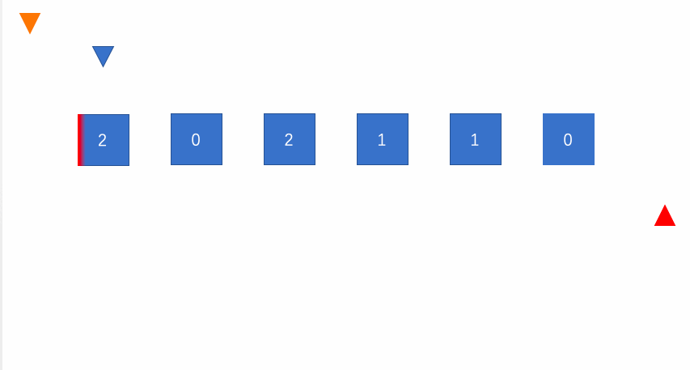

## 题目描述

给定一个包含红色、白色和蓝色，一共 n 个元素的数组，原地对它们进行排序，使得相同颜色的元素相邻，并按照红色、白色、蓝色顺序排列。

此题中，我们使用整数 0、 1 和 2 分别表示红色、白色和蓝色。

## 样例

```
Input：nums = [2,0,2,1,1,0]
Output：[0,0,1,1,2,2]
```

## 题目解析

> 参考：[每天一算：Sort Colors](https://mp.weixin.qq.com/s/4pz_1AyCjOZu3Ki0kE61FQ)

不建议直接使用排序算法，可以使用参考快排双指针，使用三指针算法。



## Python示例

```python
class Solution:
    def sortColors(self, nums: List[int]) -> None:
        """
        Do not return anything, modify nums in-place instead.
        """
        zero, two = -1, len(nums)
        i = 0 
        while i < two:
            if nums[i] == 2:
                two -= 1
                nums[i], nums[two] = nums[two], nums[i]
            elif nums[i] == 1:
                i += 1
            else: # nums[i] == 0 
                zero += 1
                nums[i], nums[zero] = nums[zero], nums[i]
                i += 1 # 思考下不加这行，面对[0,0,0,1,1,1]
```

```go
func sortColors(nums []int)  {
    n := len(nums)
    zero, two := -1, n 
    one := 0
    for one < two {
        if nums[one] == 2 {
            two --
            nums[one], nums[two] = nums[two], nums[one]
        } else if nums[one] == 1 {
            one ++
        } else {
            zero ++
            nums[zero], nums[one] = nums[one], nums[zero]
            one ++ // 必须加这一行
        }
    }
}
```

