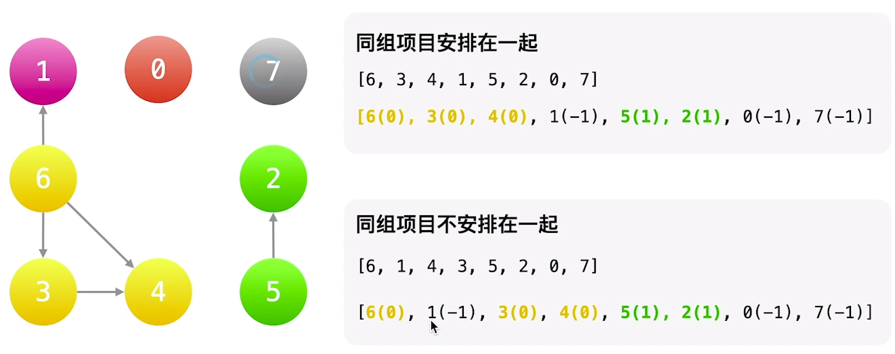

## 题目描述

公司共有 `n` 个项目和  `m` 个小组，`group[i]` 表示第 `i` 个项目所属的小组，如果这个项目目前无人接手，那么 `group[i]` 就等于 `-1`。`beforeItems[i]` 记录了在完成第 i 个项目完成之前必须完成的项目编号。

现在要求给小组排序 ，要求

- 同一个小组的项目，需要排在一起，也就是同一小组的项目一起完成、
- 项目之间存在依赖关系。
- 多个解决方案，任意返回一个即可。

## 样例


```
Input: n = 8, m = 2, group = [-1,-1,1,0,0,1,0,-1], beforeItems = [[],[6],[5],[6],[3,6],[],[],[]]
Output: [6,3,4,1,5,2,0,7]
```

## 题解

拓扑排序

本题存在两个拓扑关系:

1. 不同项目组间有先后执行的关系
2. 同一项目组内有先后执行的关系 

所以需要两次拓扑排序



## 代码

```go
func  topSort(graph [][]int, degree, items []int) (order []int) {
	q := make([]int, 0)
	for  _, itemId := range items { // 从入度为0的节点开始遍历
		if degree[itemId] == 0 {
			q = append(q, itemId)
		}
	}

	for len(q) > 0 {
		from := q[0]
		q = q[1:]
		order = append(order, from)
		for _, to := range graph[from] { 
			degree[to]-- // 删除 from 节点
			if degree[to] == 0 { // 如果删除 from 节点后，度也为0，加入队列中
				q = append(q, to) 
			}
		}
	}
	return // 必须写 return
}
func sortItems(n int, m int, group []int, beforeItems [][]int) []int {
  // 本题存在两个拓扑关系: 
  // 1. 不同项目组间有先后执行的关系 
  // 2. 同一项目组内有先后执行的关系 

  // 1. 对于-1的组，需要重新编号
	for i, _ := range group {
		if group[i] == -1 {
			group[i] = m
			m++
		}
	}
  
  // groupId 的上限为 m 组
  // 2. 建立组和项目之间的关系
	group2item := make([][]int, m)
	for itemId, groupId := range group {
		group2item[groupId] = append(group2item[groupId], itemId)
	}

  // 3. 根据beforeItems建立拓扑图
	itemGraph := make([][]int, n)
	itemDegree := make([]int, n)
	groupGraph := make([][]int, m)
	groupDegree := make([]int, m)

	for curItemId, preItems := range beforeItems {
		curGroupId := group[curItemId]
		for _, preItemId := range preItems {
			preGroupId := group[preItemId]
			if curGroupId == preGroupId { // 如果是同组的项目,建立组内拓扑图
				itemGraph[preItemId] = append(itemGraph[preItemId], curItemId)
				itemDegree[curItemId]++
			} else { // 如果是不同组的项目,建立组间拓扑图
				groupGraph[preGroupId] = append(groupGraph[preGroupId], curGroupId)
				groupDegree[curGroupId]++
			}
		}
	}

  // 4. 记录 groupItem 的组号，有 m 个组
	groupItems := make([]int, 0)
	for i:=0; i < m; i++ {
		groupItems = append(groupItems, i)
	}

	ans := make([]int, 0)
  // 5. 先对 组 进行拓扑排序
	groupOrder := topSort(groupGraph, groupDegree, groupItems)
	if len(groupOrder) < len(groupItems) { // 拓扑的一个作用是检查图是否存在环结构
		return []int{}
	}
	
	for _, groupId := range groupOrder {
    // 6. 按照组的顺序，对组内项目进行拓扑排序
		itemOrder := topSort(itemGraph, itemDegree, group2item[groupId])
		if len(itemOrder) < len(group2item[groupId]) { // 拓扑的一个作用是检查图是否存在环结构
			return []int{}
		}
		ans = append(ans, itemOrder...)
	}
	return ans 
}

```

