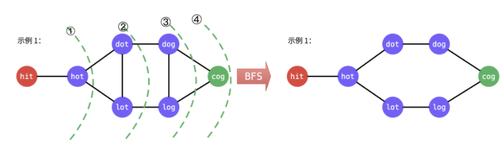
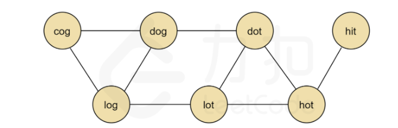
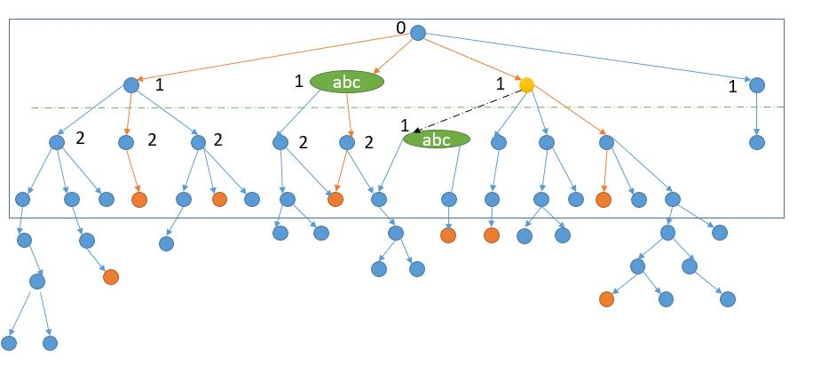
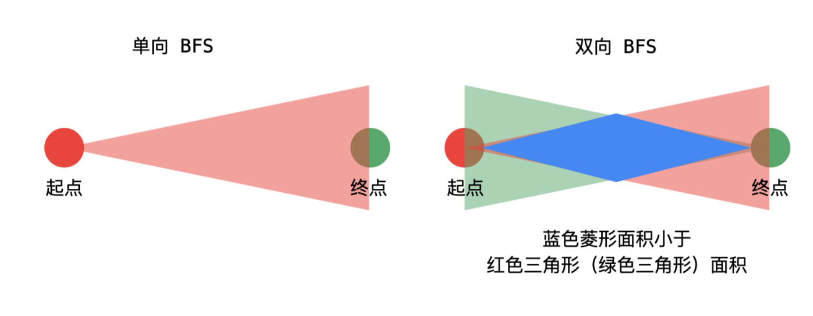

## 题目描述

给定两个单词（beginWord 和 endWord）和一个字典 wordList，找出所有从 beginWord 到 endWord 的最短转换序列。转换需遵循如下规则：

1. 每次转换只能改变一个字母。
2. 转换后得到的单词必须是字典中的单词。

说明：

- 如果不存在这样的转换序列，返回一个空列表。
- 所有单词具有相同的长度。
- 所有单词只由小写字母组成。
- 字典中不存在重复的单词。
- 你可以假设 beginWord 和 endWord 是非空的，且二者不相同。

## 样例

```
Input:
beginWord = "hit",
endWord = "cog",
wordList = ["hot","dot","dog","lot","log","cog"]

Ouptut:
[
  ["hit","hot","dot","dog","cog"],
  ["hit","hot","lot","log","cog"]
]
```

## 题解

**单层 BFS** 

> 图参考：[单双向广度优先遍历 + 回溯算法（Java、Python）](https://leetcode-cn.com/problems/word-ladder-ii/solution/yan-du-you-xian-bian-li-shuang-xiang-yan-du-you--2/)



## 单层无优化 BFS 代码

这里的图的建立是通过  **层次遍历法** 建立的关系。

```python
# 超时 20/39
from collections import deque 
def diffOneletter(word1, word2):
    c = 0
    for i in range(len(word1)):
        if word1[i] != word2[i]:
            c += 1
    return c == 1

class Solution:
    def findLadders(self, beginWord: str, endWord: str, wordList: List[str]) -> List[List[str]]:
        queue = deque()
        queue.append([beginWord, [beginWord]])
        ans = []
        find = False 
        while queue:
            for _ in range(len(queue)):
                word, path = queue.popleft()
                if word == endWord:
                    ans.append(path[:])
                    find = True 
                for i in range(len(wordList)):  # 通过不停的试建立了 字与字的关系
                    if wordList[i] not in path and diffOneletter(word, wordList[i]):
                        queue.append([wordList[i], path + [wordList[i]]])
            if find: 
                break 
        return ans 
```

代码实现了基本的BFS思想，但是存在很多优化的点：

- `diffOneletter` 存在大量重复计算
- 由于是要求出所有最短路径集合，而不是最短步数，如果不加剪枝策略的话，一定会超时。

## 单层BFS优化① 

> 参考：[LeetCode 官方题解](https://leetcode-cn.com/problems/word-ladder-ii/solution/dan-ci-jie-long-ii-by-leetcode-solution/)的思路

这里的优化体现在，首先根据 wordList 字典来 **建立一张图**，使用邻接矩阵实现。

```python
edges = defaultdict(set)
for word1 in wordList:
  for word2 in wordList:
    if diffOneletter(word1, word2):
      edges[word1].add(word2)
      edges[word2].add(word1)
```





```python
# 超时 32/39
from collections import deque, defaultdict
def diffOneletter(word1, word2):
    c = 0
    for i in range(len(word1)):
        if word1[i] != word2[i]:
            c += 1
    return c == 1

class Solution:
    def findLadders(self, beginWord: str, endWord: str, wordList: List[str]) -> List[List[str]]:
        # 当 endWord 不存在的时候，就返回空数组
        if endWord not in wordList: 
            return []
        # 创建邻接矩阵
        if beginWord not in wordList:
            wordList.append(beginWord)
        edges = defaultdict(list)
        for i in range(len(wordList)):
            for j in range(i + 1, len(wordList)):
                if diffOneletter(wordList[i], wordList[j]):
                    edges[wordList[i]].append(wordList[j])
                    edges[wordList[j]].append(wordList[i])
        
        queue = deque()
        queue.append([beginWord])
        visited = set()
        visited.add(beginWord)
        ans = []
        find = False 
        while queue:
            subvisited = set() # 集合记录下一层的节点，可以做到去重
            for _ in range(len(queue)):
                path = queue.popleft()
                cur_word = path[-1]
                if cur_word == endWord:
                    ans.append(path[:])  # 这里使用 path 每次直接保存了路径，但是很多解法认为这样做法会极大消耗空间，所以一般是通过 BFS 建立词与词的关系图，然后再使用 DFS 寻找最优路径。
                    find = True 
                for word in edges[cur_word]:
                    if word not in visited and :
                        queue.append(path + [word])
                        subvisited.add(word)
            for word in subvisited: # 同一层遍历结束后，再加入
                visited.add(word)
            if find: 
                break 
        return ans 
```

这样优化的 Python 代码无法AC，但是等价的 Java 是可以的，不过也是属于极限状态。

为了继续优化，我们参考 [详细通俗的思路分析，多解法](https://leetcode-cn.com/problems/word-ladder-ii/solution/xiang-xi-tong-su-de-si-lu-fen-xi-duo-jie-fa-by-3-3/) 记录每一个节点的层信息，当 abc 出现第二次的时候，由于曾经访问过，就不应该继续搜索了。




## 双向广搜 




```python
def backtracking(src, dst, successors, path, ans):
    if src == dst:
        ans.append(path[:])
        return 
    for cur in successors[src]:
        path.append(cur)
        backtracking(cur, dst, successors, path, ans)
        path.pop()
    
class Solution:
    def findLadders(self, beginWord: str, endWord: str, wordList: List[str]) -> List[List[str]]:
        if endWord not in wordList:  # 如果endWord不存在的话，一定是出不来答案
            return []
        q1, q2 = {beginWord}, {endWord}  # 这里注意不能使用 list 会超时的，必须使用 set 哈希表
        notVisitedWords = set(wordList)  # 记录了所有没有访问过的单词
        if beginWord in notVisitedWords:  # beginWord 不一定会在 wordList 中
            notVisitedWords.remove(beginWord)
        notVisitedWords.remove(endWord)

        successors = defaultdict(set)  # bfs 用来记录字典的图关系
        reverse = False
        found = False
        while q1:  # 先使用 q1 
            visitedWords = set()
            for curWord in q1:
                for j in range(len(curWord)):
                    ch = curWord[j]
                    for k in range(26):
                        nextList = list(curWord)
                        nextList[j] = chr(ord('a') + k)
                        nextWord = ''.join(nextList)
                        if nextWord in q2:  # 如果在q2中出现过，证明已经找到了
                            found = True
                            if not reverse:
                                successors[curWord].add(nextWord)
                            else:
                                successors[nextWord].add(curWord)
                        if nextWord in notVisitedWords:  # 如果nextWord是合法的
                            if not reverse:
                                successors[curWord].add(nextWord)
                            else:
                                successors[nextWord].add(curWord)
                            visitedWords.add(nextWord)  # 记录访问过的单词
            if found:  # 剪枝
                break 
            for word in visitedWords:  # 将所有访问过的节点从未访问过的节点中去除
                if word in notVisitedWords:
                    notVisitedWords.remove(word)
            if len(visitedWords) <= len(q2):  # 根据节点的大小调整搜索的方向
                q1 = visitedWords  # 记录从左搜索
            else:
                reverse = not reverse  # 翻转，换个方向搜索
                q1 = q2
                q2 = visitedWords
        ans = []
        if found:  # 使用 dfs 搜索出最优路径
            path = [beginWord]
            backtracking(beginWord, endWord, successors, path, ans)
        return ans
```

