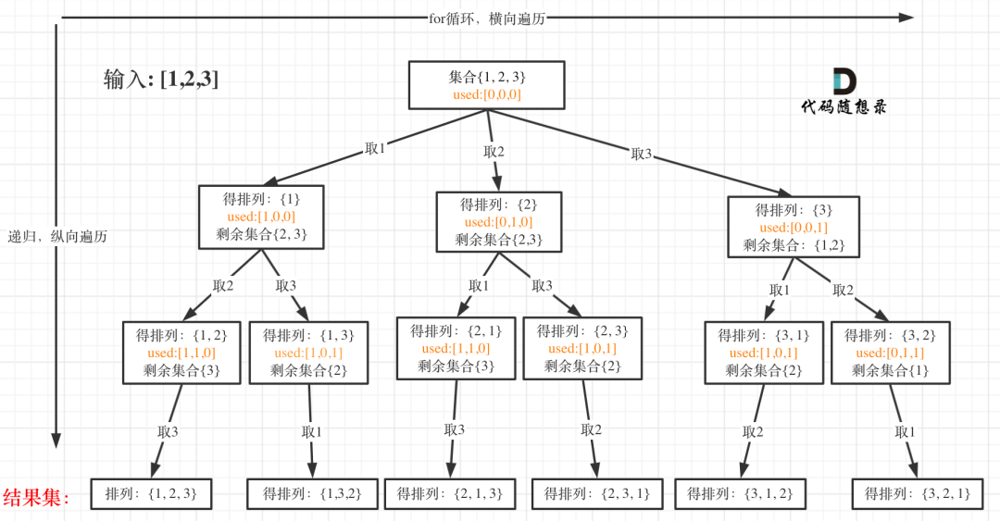

## 题目描述

给定一个 **没有重复** 数字的序列，返回其所有可能的全排列。

## 样例

```
Input: [1,2,3]
Output:
[
  [1,2,3],
  [1,3,2],
  [2,1,3],
  [2,3,1],
  [3,1,2],
  [3,2,1]
]
```

## 题目解析

全排列实现有两种方式：

**第一种方式：使用 tmp 数组变化**

> 图解来自：[全排列算法](https://mp.weixin.qq.com/s?__biz=MzUxNjY5NTYxNA==&mid=2247485493&idx=1&sn=2b5a4e977fb2a2635859bd0cc831db64&scene=21#wechat_redirect)



```
# tmp 数组的变化
[]
[1]
[1, 2]
[1, 2, 3] <-- 加入ans 
[1, 3]
[1, 3, 2] <-- 加入ans 
[2]
[2, 1]
[2, 1, 3] <-- 加入ans 
[2, 3]
[2, 3, 1] <-- 加入ans 
[3]
[3, 1]
[3, 1, 2] <-- 加入ans 
[3, 2]
[3, 2, 1] <-- 加入ans 
```

**第二种方式：通过置换的方法**

对于每一个当前位置 i，我们可以将其于之后的任意位置交换， 然后继续处理位置 i+1，直到处理到最后一位。为了防止我们每此遍历时都要新建一个子数组储存位置 i 之前已经交换好的数字，我们可以利用回溯法，只对原数组进行修改，在递归完成后再 修改回来。

## Python示例

**第一种方式：使用 tmp 数组变化**

```python
def backtrack(nums, ans, visited, tmp):
    if len(tmp) == len(nums): # 找到叶子节点
        ans.append(tmp[:]) # 浅拷贝
        return 
    
    for num in nums:
        if num not in visited:
            visited.add(num) # 记录状态
            tmp.append(num) # 记录状态
            backtrack(nums, ans, visited, tmp)
            visited.remove(num) # 回溯状态
            tmp.remove(num) # 回溯状态

class Solution:
    def permute(self, nums: List[int]) -> List[List[int]]:
        ans = []
        backtrack(nums, ans, set(), [])
        return ans 
```

**第二种方式：通过置换的方法**

```python
def backtrack(nums, level, ans):
    if level == len(nums) - 1:
        ans.append(nums)
    for i in range(level, len(nums)):
        nums[level], nums[i] = nums[i], nums[level] # 记录状态
        backtrack(nums, level + 1, ans)
        nums[level], nums[i] = nums[i], nums[level] # 回溯状态
    
class Solution:
    def permute(self, nums: List[int]) -> List[List[int]]:
        ans = []
        backtrack(nums, 0, ans)
        return ans 
```

