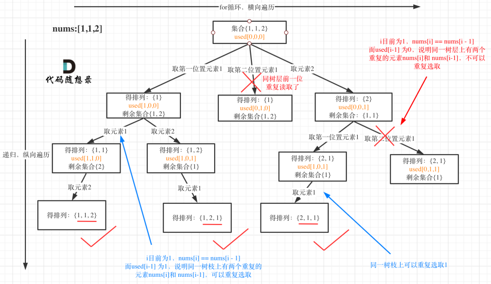
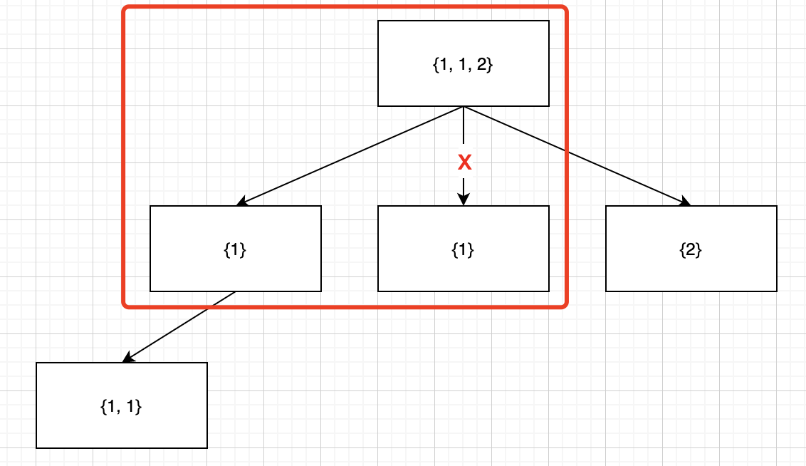
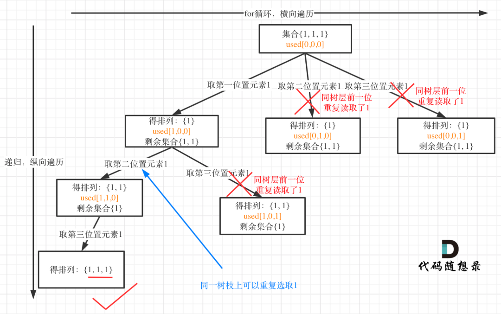

## 题目描述

给定一个**可包含重复数字**的序列 `nums` ，**按任意顺序** 返回所有不重复的全排列。

## 样例

```
Input：nums = [1,1,2]
Output：
[[1,1,2],
 [1,2,1],
 [2,1,1]]
```

## 题目解析

本题是 [46. 全排列](https://leetcode-cn.com/problems/permutations/) 的变形，包含了重复数字。第一种思路是 [46. 全排列](https://leetcode-cn.com/problems/permutations/) 的去重，但是由于是访问了很多不必要的节点，很明显是低效的。

需要进行剪枝，剪枝图解：



剪枝的操作体现在，若是当前元素是和前一元素相等，且前一元素是还没有用过（用过的话是不冲突的）。

可以从上面的图很明显的看出，当第一个 1 没有选中，但是第二个 1 选中的时候，可以剪枝。当第一个选中了，再选第二个，就成了 {1, 1}，是可以的。



**核心代码** 

```python
num.sort()
if (num[i] == num[i - 1] and visited[i - 1] == False):
    continue # 跳过，剪枝
```

**疑惑 visited[i - 1] == False**  

visited[i - 1] 设置为 True 和 False 都是可行的，但是 `visited[i - 1] == False` 剪枝更少，效率更高。

<div style="display: flex">


</div>

## Python示例

```python
def backtracking(nums, ans, visited, tmp):
    if len(tmp) == len(nums):
        ans.append(tmp[:])
        return
    
    for i in range(len(nums)): # + 添加剪枝代码
        if i > 0 and nums[i] == nums[i - 1] and not visited[i - 1]: # + 添加剪枝代码
            continue # + 添加剪枝代码
        if not visited[i]:
            visited[i] = 1
            tmp.append(nums[i])
            backtracking(nums, ans, visited, tmp)
            visited[i] = 0 
            tmp.pop()
    

class Solution:
    def permuteUnique(self, nums: List[int]) -> List[List[int]]:
        visited = [0] * len(nums)
        ans = []
        nums.sort() # 添加剪枝代码
        backtracking(nums, ans, visited, [])
        return ans 
```

