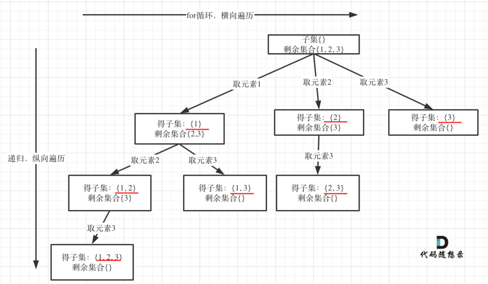

## 题目描述

给定一组**不含重复元素**的整数数组 *nums*，返回该数组所有可能的子集（幂集）。

## 样例

```
Input: nums = [1,2,3]
Output:
[
  [3],
  [1],
  [2],
  [1,2,3],
  [1,3],
  [2,3],
  [1,2],
  []
]
```

## 题目解析

本题是一道模板题，是根据 [77. 组合(Medium)](/pages/d99a0a/) 改变而来。

> 参考：[回溯算法：求子集问题！](https://mp.weixin.qq.com/s?__biz=MzUxNjY5NTYxNA==&mid=2247485402&idx=1&sn=6963af3e2aa8d58e41b71d73d53ea8f6&scene=21#wechat_redirect)

这篇文章总结的很好：**「在树形结构中子集问题是要收集所有节点的结果，而组合问题是收集叶子节点的结果」**。



## Python 代码示例

```python
def backtracking(nums, ans, visited, cur, tmp):
    # 记录所有中间节点，即是遍历整课树，没有回退条件
    ans.append(tmp[:])
    for i in range(cur, len(nums)):
        tmp.append(nums[i])
        backtracking(nums, ans, visited, i + 1, tmp) # i + 1 保证了不会出现死循环
        tmp.pop()
    
class Solution:
    def subsets(self, nums: List[int]) -> List[List[int]]:
        visited = [0] * len(nums)
        ans = []
        backtracking(nums, ans, visited, 0, [])
        return ans
```

## 参考资料

1. [回溯算法：求子集问题！](https://mp.weixin.qq.com/s?__biz=MzUxNjY5NTYxNA==&mid=2247485402&idx=1&sn=6963af3e2aa8d58e41b71d73d53ea8f6&scene=21#wechat_redirect)