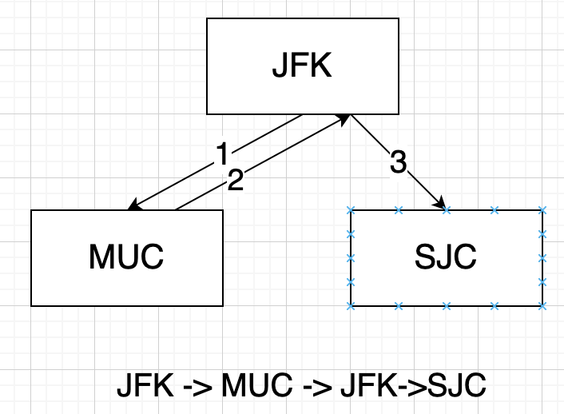

## 题目描述

给定一个机票的字符串二维数组 [from, to]，子数组中的两个成员分别表示飞机出发和降落的机场地点，对该行程进行重新规划排序。所有这些机票都属于一个从 JFK（肯尼迪国际机场）出发的先生，所以该行程必须从 JFK 开始。

> 注意事项：

- 如果存在多种有效的行程，请你按字符自然排序返回最小的行程组合。例如，行程 ["JFK", "LGA"] 与 ["JFK", "LGB"] 相比就更小，排序更靠前
- 所有的机场都用三个大写字母表示（机场代码）。
- 假定所有机票至少存在一种合理的行程。
- 所有的机票必须都用一次 且 只能用一次。

## 样例

```
Input：[["MUC", "LHR"], ["JFK", "MUC"], ["SFO", "SJC"], ["LHR", "SFO"]]
Output：["JFK", "MUC", "LHR", "SFO", "SJC"]

Input：[["JFK","SFO"],["JFK","ATL"],["SFO","ATL"],["ATL","JFK"],["ATL","SFO"]]
Output：["JFK","ATL","JFK","SFO","ATL","SFO"]
解释：另一种有效的行程是 ["JFK","SFO","ATL","JFK","ATL","SFO"]。但是它自然排序更大更靠后。
```

## 题目解析

本题的题意是帮助 `一个旅客` 规划行程，就可以很清晰了。只要通过深搜 +  回溯的算法就可以解决。

很多的题解中存在 `死循环` 的困惑，我认为完全不会，因为**机票只能用一次**，而不是航线可以走多次。



## Python示例

使用 深度搜索 和 回溯法实现，这里使用 visited 记录机票的使用次数。

```python
def backtracking(tickets, ans, visited, cur, tmp):
    if ans: return  # 找到答案
    
    if sum(visited) == len(visited): # 全部访问过一次
        ans.extend(tmp) # 为了传值出去， 必须使用这样方式
        return 
 
    for i in range(len(tickets)):
        if tickets[i][0] != cur or visited[i]: # 1. 初始城市正确 2. 没有乘坐过
            continue
        visited[i] = 1
        tmp.append(tickets[i][1])
        backtracking(tickets, ans, visited, tickets[i][1], tmp)
        tmp.pop()
        visited[i] = 0

class Solution:
    def findItinerary(self, tickets: List[List[str]]) -> List[str]:
        tickets.sort(key=lambda x: (x[0], x[1])) # 保证最后呈现的是字典序的结果
        ans = []
        visited = [0] * len(tickets)
        backtracking(tickets, ans, visited, 'JFK', ['JFK'])
        return ans 
```

这一版的代码耗时上比较严重，原因在于每次都是遍历 tickets 机票，这样的效率比较低。一般都采用 哈希表 记录飞机的起飞地。如[回溯算法：重新安排行程](https://mp.weixin.qq.com/s?__biz=MzUxNjY5NTYxNA==&mid=2247485596&idx=1&sn=4a6ab3905fb1076cbb7f78673ef8afad&scene=21#wechat_redirect) 、[python回溯算法，击败95.23%](https://leetcode-cn.com/problems/reconstruct-itinerary/solution/pythonhui-su-suan-fa-ji-bai-9523-by-yun-yi-hen/) 。

下面是我的改进代码，和上面两者略微一点不一样。

```python
from collections import defaultdict
def backtracking(tickets, ticket_dict, visited, ans, cur, tmp):
    if ans: return # 找到答案

    if len(tmp) == len(visited) + 1: # 找到答案，输出
        ans.extend(tmp)
        return 
    
    ticket_dict[cur].sort(key=lambda x: x[0]) # 满足字典序要求
    for to, index in ticket_dict[cur]:
        if visited[index]:
            continue
        visited[index] = 1
        tmp.append(to)
        backtracking(tickets, ticket_dict, visited, ans, to, tmp)
        tmp.pop()
        visited[index] = 0

class Solution:
    def findItinerary(self, tickets: List[List[str]]) -> List[str]:
        visited = [0] * len(tickets)
        ticket_dict = defaultdict(list)
        for i in range(len(tickets)):
            ticket_from = tickets[i][0]
            ticket_dict[ticket_from].append((tickets[i][1], i)) # 出发站: (终点站, 车票序号) 
        ans = [] 
        backtracking(tickets, ticket_dict, visited, ans, 'JFK', ['JFK'])
        return ans
```

 如果不使用 visited 数组，也可以直接更改数组元素实现

```python
class Solution:
    def findItinerary(self, tickets):
        from collections import defaultdict
        ticket_dict = defaultdict(list)
        for item in tickets:
            ticket_dict[item[0]].append(item[1])

        path = ['JFK']

        def backtrack(cur_from):
            if len(path) == len(tickets) + 1:  # 结束条件
                return True
            ticket_dict[cur_from].sort()
            for _ in ticket_dict[cur_from]:
                cur_to = ticket_dict[cur_from].pop(0)  # 删除当前节点
                path.append(cur_to)  # 做选择
                if backtrack(cur_to):  # 进入下一层决策树
                    return True
                path.pop()  # 取消选择
                ticket_dict[cur_from].append(cur_to)  # 恢复当前节点
            return False

        backtrack('JFK')
        return path

# 作者：yun-yi-hen
# 链接：https://leetcode-cn.com/problems/reconstruct-itinerary/solution/pythonhui-su-suan-fa-ji-bai-9523-by-yun-yi-hen/
```

