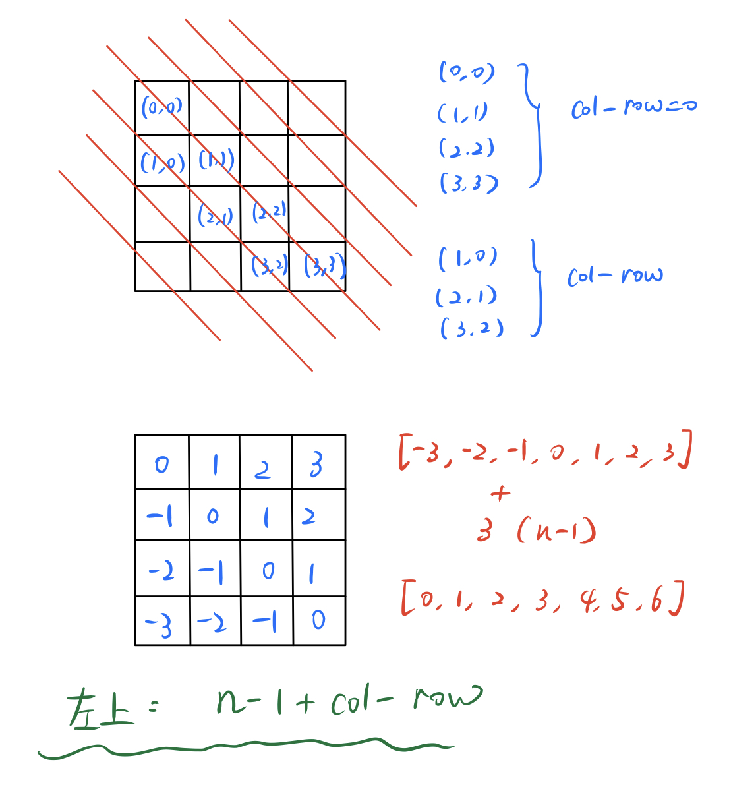

## 题目描述

*n* 皇后问题研究的是如何将 *n* 个皇后放置在 *n*×*n* 的棋盘上，并且使皇后彼此之间不能相互攻击。


## 示例

```
Input：4
Output：[
 [".Q..",  // 解法 1
  "...Q",
  "Q...",
  "..Q."],

 ["..Q.",  // 解法 2
  "Q...",
  "...Q",
  ".Q.."]
]
```

## 题目解析

本题虽然是 Hard，但是从思路上来说，就是通过修改状态矩阵来进行回溯。

因为每一行只有一个皇后，我们可以按行回溯，每次修改状态矩阵前需要对 `列`、`左上`、`右上` 进行检查。

## Python代码示例

这一版Python代码参考：回溯算法：[N皇后问题 -C++版](https://mp.weixin.qq.com/s?__biz=MzUxNjY5NTYxNA==&mid=2247485624&idx=1&sn=d560c3a277e1badedc0fa05b8effae87&scene=21#wechat_redirect) 。是比较常规的回溯算法编写。

```python
def isValid(r, c, chessbox):
    # 竖
    for i in range(r):
        if chessbox[i][c] == "Q":
            return False 
    # 左上 
    i, j = r - 1, c - 1
    while i >=0 and j >= 0:
        if chessbox[i][j] == "Q":
            return False 
        i -= 1
        j -= 1
    
    # 右上 
    i, j = r - 1, c + 1
    while i >=0 and j < len(chessbox):
        if chessbox[i][j] == "Q":
            return False 
        i -= 1
        j += 1
    return True 

def backtracking(n, ans, row, chessbox):
    if row == n:
        ans.append([''.join(i) for i in chessbox])
        return 

    for i in range(n):
        if not isValid(row, i, chessbox): # 检查是否符合规则
            continue
        chessbox[row][i] = "Q"
        backtracking(n, ans, row + 1, chessbox)
        chessbox[row][i] = "."

class Solution:
    def solveNQueens(self, n: int) -> List[List[str]]:
        ans = []
        chessbox = [["."] * n for _ in range(n)]
        backtracking(n, ans, 0, chessbox)
        return ans
```

除了每次编写检查代码 `checkbox` 检查是否符合逻辑，也可以使用 对每一行、列、左斜、右斜建立访问数组，来记录它们是否存在皇后。

下面的代码参考了：**《A LeetCode Grinding Guide》** 这本书。

其难点在于，如何确定访问数组的规则。

- 每一行：按行迭代，已经保证了行是不会重复的

- 每一列：

- 左斜：`n - 1 + col - row` 可以将左斜的数组范围映射到  [0, 2 * (n - 1) ] 的范围内

- 右斜：`row + col` 可以将左斜的数组范围映射到  [0, 2 * (n - 1) ] 的范围内

推导过程如下：
  

```python
def backtracking(n, ans, row, chessbox, columns, ldiag, rdiag):
    if row == n:
        ans.append([''.join(i) for i in chessbox])
        return 

    for i in range(n):
        if columns[i] or ldiag[n - 1 + i - row] or rdiag[i + row]:
            continue
        chessbox[row][i] = "Q"
        columns[i] = ldiag[n - 1 + i - row] = rdiag[i + row] = 1
        backtracking(n, ans, row + 1, chessbox, columns, ldiag, rdiag)
        columns[i] = ldiag[n - 1 + i - row] = rdiag[i + row] = 0
        chessbox[row][i] = "."

class Solution:
    def solveNQueens(self, n: int) -> List[List[str]]:
        ans = []
        columns = [0] * n 
        ldiag = [0] * (2 * (n - 1) + 1) # 数组范围是 0 ~ 2 *(n + 1) 
        rdiag = [0] * (2 * (n - 1) + 1) # 数组范围是 0 ~ 2 *(n + 1) 
        chessbox = [["."] * n for _ in range(n)]
        backtracking(n, ans, 0, chessbox, columns, ldiag, rdiag)
        return ans
```

改良后的执行时间下降很多。