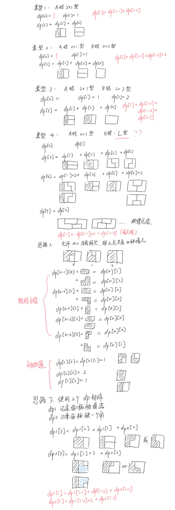

## 题解



## 示例代码

**思路2 代码**

```python
class Solution:
    def numTilings(self, N: int) -> int:
        if N == 0: # 边界值处理
            return 1
        elif N == 1:
            return 1
        elif N == 2:
            return 2
        
        # 初始条件
        dp = [[0] * 3 for _ in range(N + 1)]
        dp[2][0] = dp[2][1] = 1
        dp[2][2] = 2
        dp[1][2] = 1

        for n in range(3, N + 1):
            dp[n][0] = dp[n - 1][0] + dp[n - 2][2]
            dp[n][1] = dp[n - 1][1] + dp[n - 2][2]
            dp[n][2] = dp[n - 1][0] + dp[n - 1][1] + dp[n - 1][2] + dp[n - 2][2]
        
        return dp[N][2] % (10 ** 9  + 7)
            
```

**思路3 代码**

```python
class Solution:
    def numTilings(self, N: int) -> int:
        if N == 0: # 边界值处理
            return 1
        elif N == 1:
            return 1
        elif N == 2:
            return 2
        
        dp1 = [0] * (N + 1)
        dp2 = [0] * (N + 1)
        
        # 初始条件
        dp1[1] = 1
        dp1[2] = 2
        dp2[2] = 2
        
        for n in range(3, N + 1):
            dp1[n] = dp1[n - 1] + dp1[n - 2] + dp2[n - 1]
            dp2[n] = dp1[n - 2] * 2 + dp2[n - 1]
        
        return dp1[N] % (10 ** 9  + 7)
```

