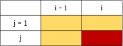

## 题目描述

给你两个单词 `word1` 和 `word2`，请你计算出将 `word1` 转换成 `word2` 所使用的最少操作数 。你可以插入、删除、更改单词。

## 样例

```
Input: word1 = "horse", word2 = "ros"
Output: 3
Explanation: 
horse -> rorse (replace 'h' with 'r')
rorse -> rose (remove 'r')
rose -> ros (remove 'e')
```

## 题解

**解法一、递归+记忆化**

类似的搜索问题太多了，通过递归可以很容易把问题拆分为子问题。

f(i, j) 代表 word1[i:] 转换成 word2[j:] 所需要的最小操作数。因为我们是从右向左搜索，这样当 i 或 j 等于 -1 的时候，就可以知道搜索结束。

> 当然也可以从左向右，只是需要 i<len(word1), j < len(word2)

- 当 s[i] == s[j] 的时候，就缩小范围 f(i - 1, j - 1) 
- 当 s[i] != s[j] 的时候，就操作，分别是 f(i, j - 1) 插入、f(i - 1, j) 删除、f(i - 1, j - 1)) 更改

## 代码示例

思路1：递归+记忆化

```go
// 本题如果一开始无法想到 动态规划，可以先用 递归先实现，后面我们发现本题像我们做过的很多搜索类的问题
// 如果 word1[i] == word[j]，那么向外扩展
// 如果 word1[i] != word[j]，那么进行操作（插删改）

func min(nums ...int) int {
    ans := math.MaxInt64
    for _, num := range nums {
        if num < ans {
            ans = num 
        }
    }
    return ans
}

func f(i, j int) int { // 记录了 i 到 j 的最少转换次数
    if i == -1 { // 如果 word1 找到了， 返回 word2 剩余的长度
        return j + 1
    }

    if j == -1 { // 如果 word2 找到了， 返回 word1 剩余的长度
        return i + 1
    }

    v, ok := cache[Key{i, j}]
    if ok {
        return v
    } 

    if s1[i] == s2[j] {
        cache[Key{i, j}] = f(i - 1, j - 1)
    } else { // 对单词进行操作
        cache[Key{i, j}] =  min(f(i, j - 1), // 插入
                                f(i - 1, j), // 删除
                                f(i - 1, j - 1)) + 1 // 更改
    }
    return cache[Key{i, j}]
}

type Key struct {
      i, j int 
}

var s1, s2 string
var cache map[Key]int

func minDistance(word1 string, word2 string) int {
    s1 = word1
    s2 = word2
    cache = make(map[Key]int)
    return f(len(word1) - 1, len(word2) - 1)
}
```

思路2：动态规划

- base case/ 初始条件

  没有特殊的情况，都是返回 0 

- 转移方程

  ```
  当 word[i] == word[j]
  dp[i][j] = dp[i - 1][j - 1]
  
  当 word[i] != word[j]
  dp[i][j] = min(dp[i - 1][j], dp[i][j - 1], dp[i - 1][j - 1]) + 1
  ```
  
- 计算顺序

  从图可以看出，是从左到右，从上到下

  


