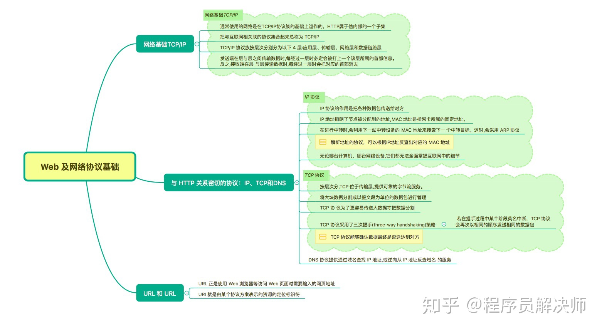
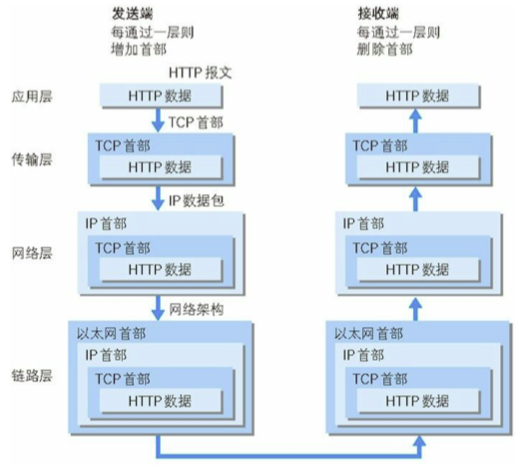
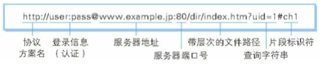
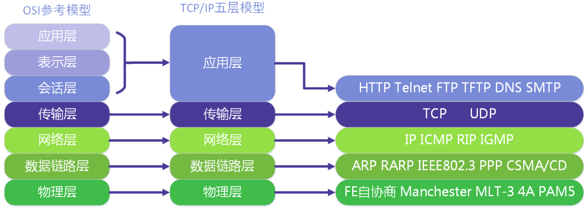

## 思维导图

> 思维导图来自： [霸天的前端笔记](https://www.zhihu.com/column/c_57862727)

## TCP/IP 通信传输流

数据向下传递的过程中会进行封装（encapsulate）

## URI包含信息

## TCP/IP 的分层管理

## 参考资源

1. 思维导图参考:  [霸天的前端笔记](https://www.zhihu.com/column/c_57862727)

   Github 仓库有Xmind：[Awsome-Front-End-Xmind](https://github.com/bailinlin/Awsome-Front-End-Xmind)

2. 原书参考：《图解HTTP》和 《HTTP权威指南》