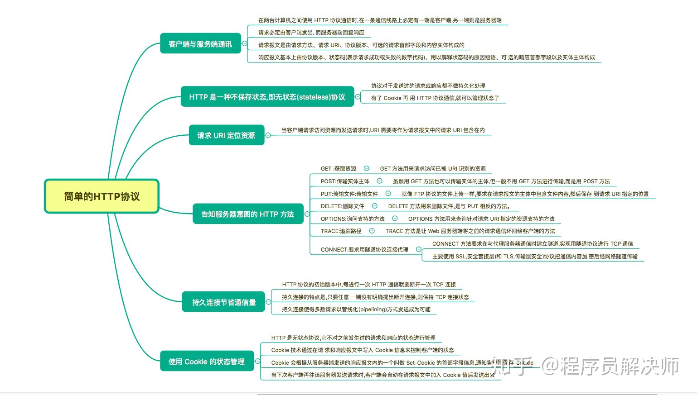
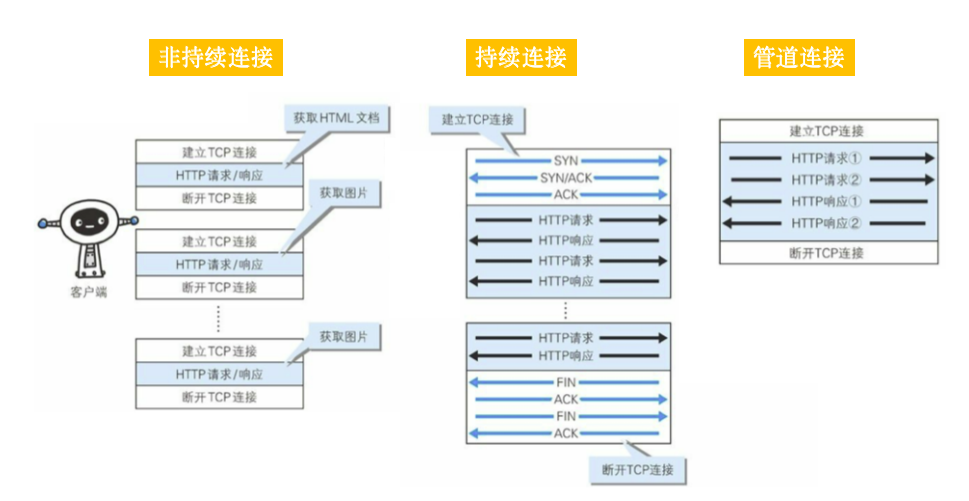

## 思维导图

> 思维导图来自： [霸天的前端笔记](https://www.zhihu.com/column/c_57862727)

## 非持久连接vs持久连接vs管道连接

持续连接：HTTP/1.1 默认连接，节约了TCP建立断开连接的时间

管道连接：支持并发发送多个请求

## 参考资源

1. 思维导图参考:  [霸天的前端笔记](https://www.zhihu.com/column/c_57862727)

   Github 仓库有Xmind：[Awsome-Front-End-Xmind](https://github.com/bailinlin/Awsome-Front-End-Xmind)

2. 原书参考：《图解HTTP》和 《HTTP权威指南》