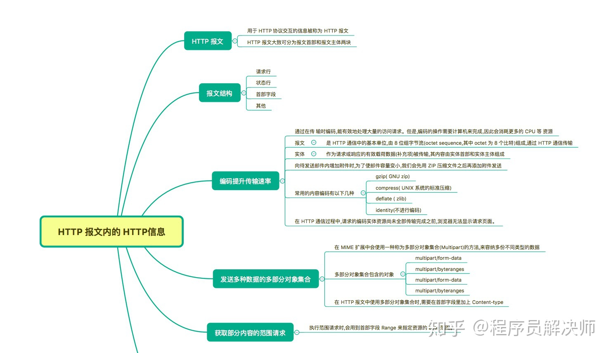
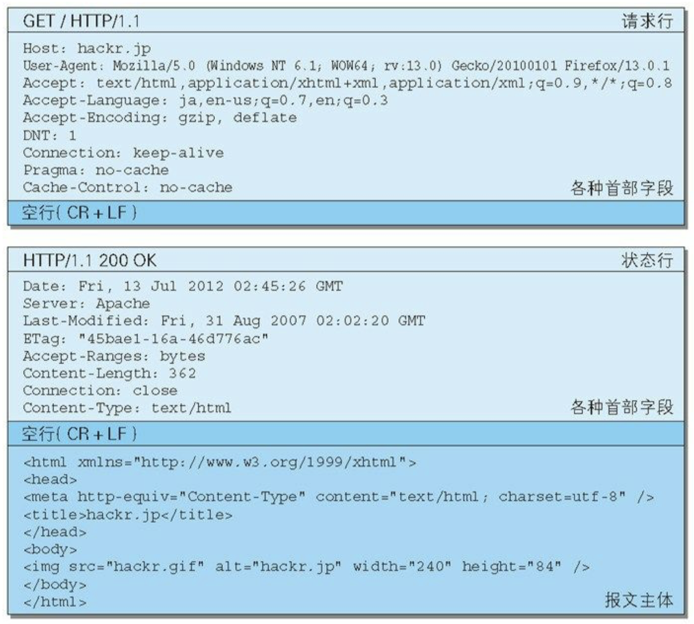

## 思维导图

> 思维导图来自： [霸天的前端笔记](https://www.zhihu.com/column/c_57862727)




## HTTP报文

- 分类：HTTP请求报文和响应报文
- 本质上是使用 ` CR+LF ` 作换行符的 **多行字符串文本**
- 报文结构:
  

## 编码提升传输速率

**目的**：压缩编码可以减小发送报文的大小，减低带宽

**常用的编码格式**：gzip(GNU zip),compress(UNIX),deflate(zlib),identity（不进行编码）

**分块传输（Chunked Transfer Coding）**： 做到游览器逐步显示，最后一块使用 `0(CR+LF)` 标记结束

## 发送多种数据的多部分对象集合

采用 **MIME**（Multipurpose Internet Mail Extensions，多用途因特网邮 件扩展）机制，用于发送邮件(文本，图片，附件)等多类型的数据。

支持的对象有:

- multipart/form-data：表单上传

  boundary 是分隔符

  ```
  Content-Type: multipart/form-data; boundary=AaB03x 　
  
  --AaB03x Content-Disposition: form-data; name="field1" 　 Joe Blow
  
  --AaB03x Content-Disposition: form-data; name="pics"; filename="file1.txt" Content-Type: text/plain 　 ...（file1.txt的数据）...
  
  --AaB03x--
  ```

- multipart/byteranges：二进制上传

  ```
  HTTP/1.1 206 Partial Content 
  Date: Fri, 13 Jul 2012 02:45:26 
  GMT Last-Modified: Fri, 31 Aug 2007 02:02:20 GMT 
  Content-Type: multipart/byteranges; boundary=THIS_STRING_SEPARATES
  
  --THIS_STRING_SEPARATES 
  Content-Type: application/pdf 
  Content-Range: bytes 500-999/8000
  
  ...（范围指定的数据）... 
  --THIS_STRING_SEPARATES 
  Content-Type: application/pdf 
  Content-Range: bytes 7000-7999/8000 # 请求 7000-7999 的数据，文件共 8000字节
  
  ...（范围指定的数据）... 
  --THIS_STRING_SEPARATES--
  ```

  针对不同类型，使用不同 Content-Type。

  当请求大文件(图片等)的时候，全部加装完再显示，体验会不好，也无法进行断点重传。


## 内容协商返回最合适的内容

内容协商机制是指客户端和服务器端就响应的资源内容进行交涉，然后提供给客户端最为适合的资源。比如  **游览器适配，语言适配，编码适配** 。内容协商会以响应资源的语言（Accept-Language）、字符集（Accept-Charset）、编码方式（Accept-Encoding）等作为判断的基准。

内容协商技术有以下 3 种类型：

- 服务器驱动协商（Server-driven Negotiation）：服务器判断，通过头部信息决定

- 客户端驱动协商（Agent-driven Negotiation）：客户端判断，通过 JS脚本，游览器类型
- 透明协商（Transparent Negotiation）：两者结合


## 参考资源

1. 思维导图参考:  [霸天的前端笔记](https://www.zhihu.com/column/c_57862727)

   Github 仓库有Xmind：[Awsome-Front-End-Xmind](https://github.com/bailinlin/Awsome-Front-End-Xmind)

2. 原书参考：《图解HTTP》和 《HTTP权威指南》