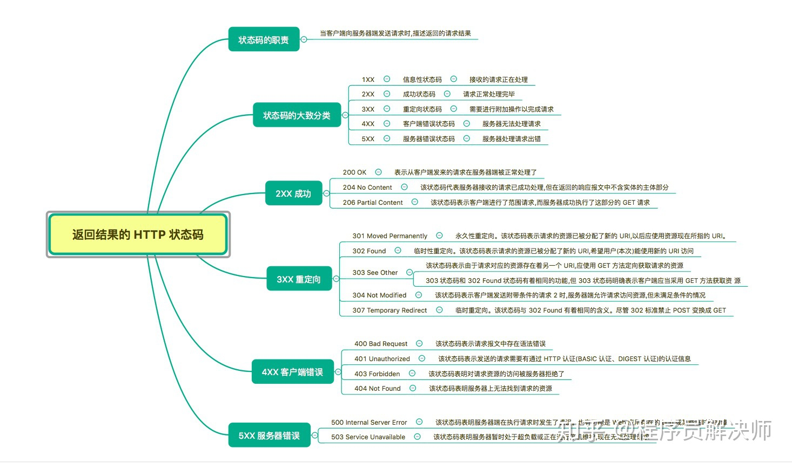

## 思维导图

> 思维导图来自： [霸天的前端笔记](https://www.zhihu.com/column/c_57862727)

## 注释

- 206 Partial Content

  包含 Content-Range 字段指明请求资源的范围

- 304 Not Modified

  允许访问资源，但是不符合附加条件。
  附加条件有：

  - If-Match，If-ModifiedSince，If-None-Match，If-Range，If-Unmodified-Since
  - If-XXX 标识 **附加条件**

## 参考资源

1. 思维导图参考:  [霸天的前端笔记](https://www.zhihu.com/column/c_57862727)

   Github 仓库有Xmind：[Awsome-Front-End-Xmind](https://github.com/bailinlin/Awsome-Front-End-Xmind)

2. 原书参考：《图解HTTP》和 《HTTP权威指南》