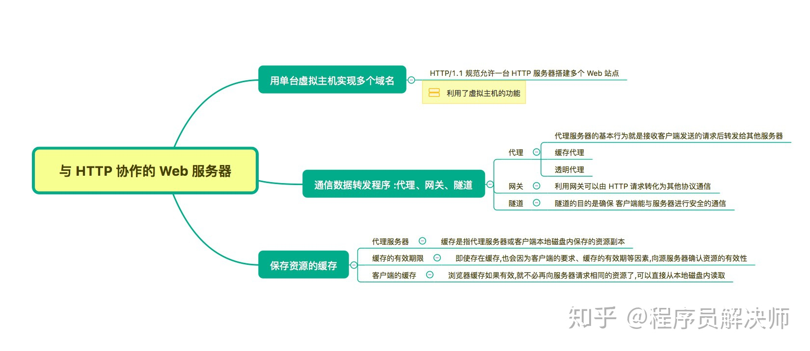
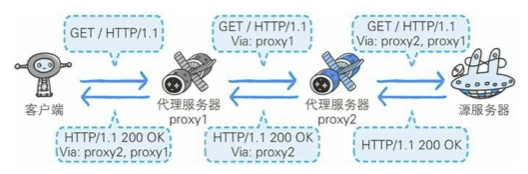
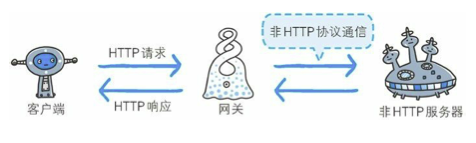

## 思维导图

> 思维导图来自： [霸天的前端笔记](https://www.zhihu.com/column/c_57862727)

## 用单台虚拟主机实现多个域名

HTTP/1.1 规范允许一台 HTTP 服务器搭建多个 Web 站点。

虚拟主机可以寄存多个不同主机名和域名的 Web 网站。

比如 网站可以通过：

- www.majusushi.world # 网站服务
- blog.majusushi.world # 博客服务
- admin.majusushi.world # 后台服务

## 通信数据转发程序 ：代理、网关、隧 道

### 代理

代理是一种有转发功能的应用程序，它扮演了位于服务器和客户 端“中间人”的角色

**代理响应过程**

- 透明代理(Transparent Proxy)：

  代理转发请求的时候，会在请求头加上 `Via` 首部信息。

- 匿名代理

**使用代理的理由**：

- 内网访问控制
- 缓存技术

### 网关

网关是转发其他服务器通信数据的服务器，可以将 HTTP请求转化为其他请求

**网关通信过程**

 

**使用代理的理由**：

- HTTP => HTTP/FTP/SOCKET链接/POP/HTTPS（非HTTP协议）
- 数据库连接
- 信用卡网关

### 隧道

隧道是在相隔甚远的客户端和服务器两者之间进行中转，并保持双方通信连接的应用程序。

隧道本身是透明的， 客户端不用在意隧道的存在，不对承载的流量进行解析

**使用隧道目的：**

- 安全的通信线路：SSL

**例子：**

如果小明和小美不在一个网段(同一个局域网)，小明是无法通过ARP广播发现小美的MAC地址。使用隧道可以实现。

隧道就是一根管子，两端是两个IP，IP仅用于网络传输，内部相当于同一个局域网。

## 保存资源的缓存

**缓存服务器**，就是代理服务器的一种，用于实现对请求资源的缓存。可以减低服务器的带宽和负担。

**缓存有效期**，缓存存在有效期，使用 max-age，Expires 等控制

**客户端缓存**，如 IE中的临时网络文件(Temporary Internet File)

## 参考资源

1. 思维导图参考:  [霸天的前端笔记](https://www.zhihu.com/column/c_57862727)

   Github 仓库有Xmind：[Awsome-Front-End-Xmind](https://github.com/bailinlin/Awsome-Front-End-Xmind)

2. 原书参考：《图解HTTP》和 《HTTP权威指南》