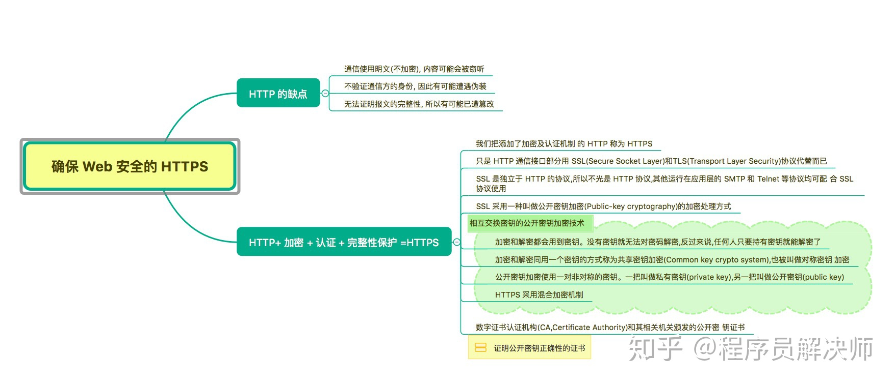
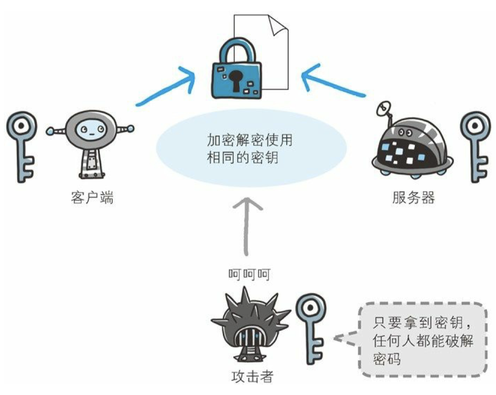
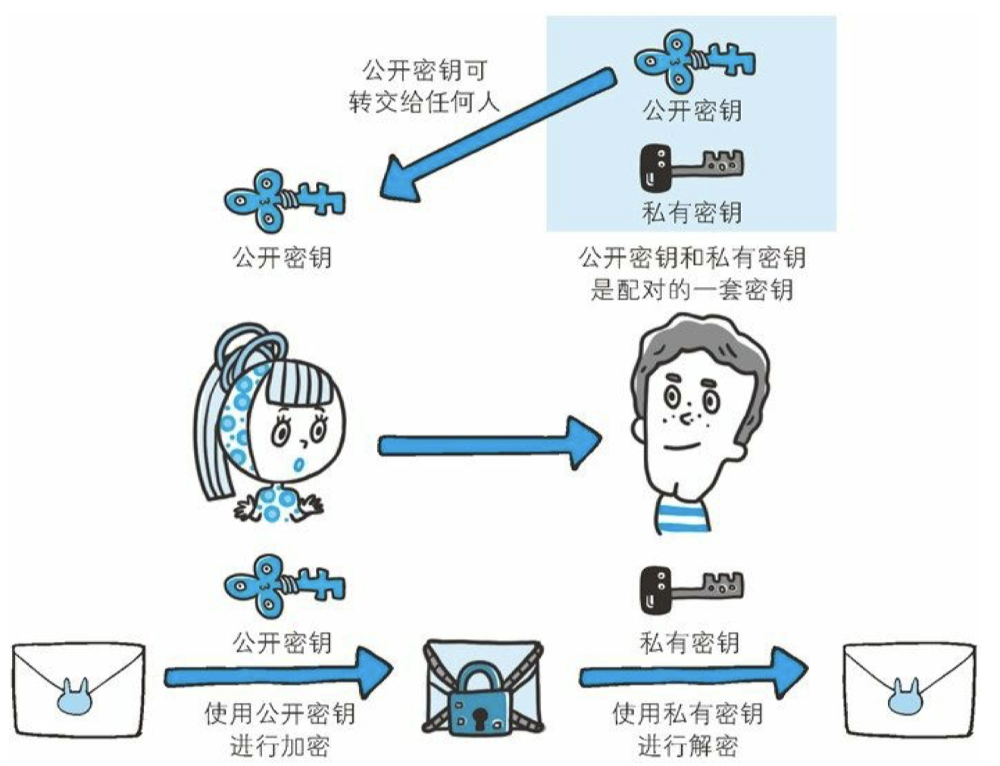
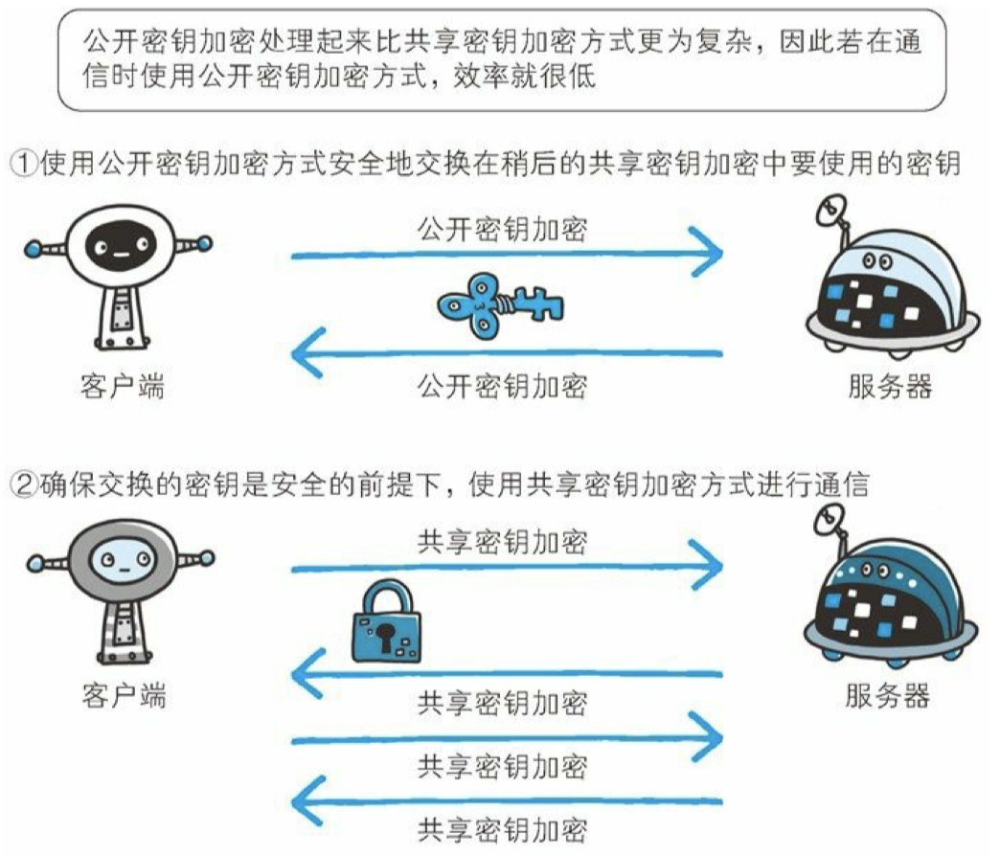
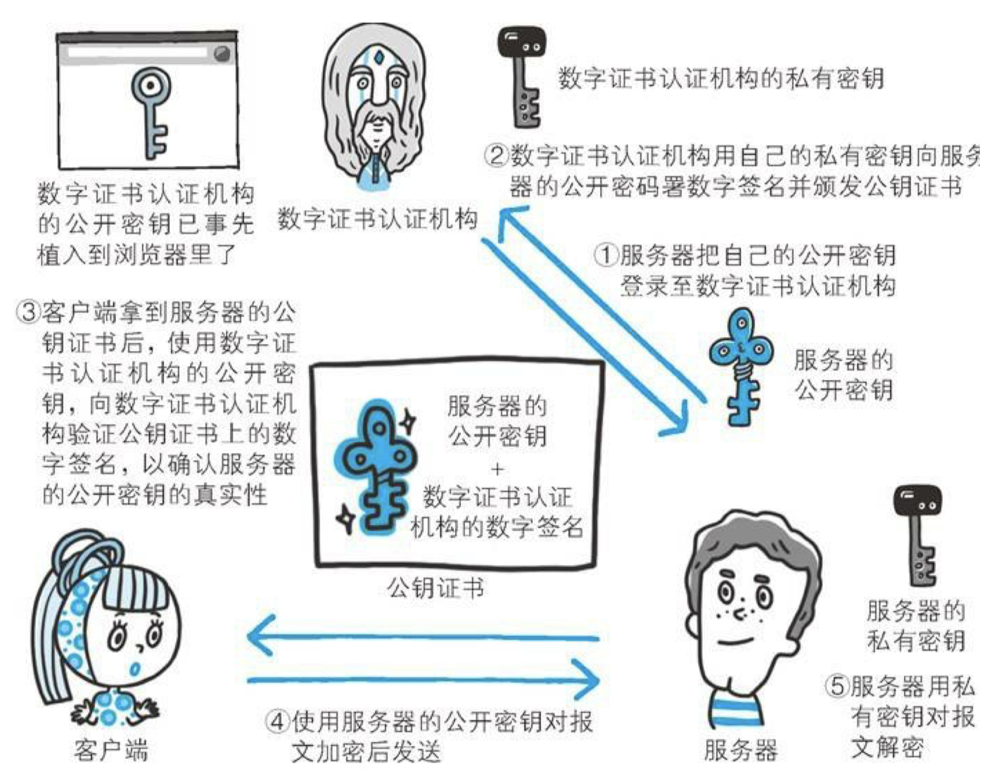
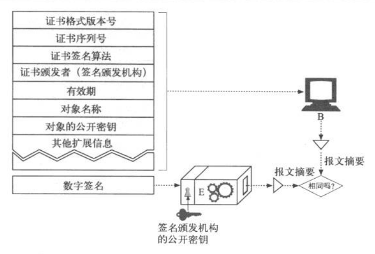

## 思维导图

> 思维导图来自： [霸天的前端笔记](https://www.zhihu.com/column/c_57862727)

## HTTP的缺点

- **窃听风险**：通信使用明文（不加密）， 内容可能会被窃听
- **伪装风险**： 无法验证通讯方身份
- **篡改风险**：无法验证报文的完整性

HTTP报文在转发的过程中是很容易受到监听，比如使用 Charles、Fiddler可以针对 HTTP 报文进行抓包。WiresShark可以针对TCP/UDP 进行抓包。

## 如何解决上述风险

- 窃听风险=>加密处理：

  - **通信的加密**：HTTP本身没有加密机制，可以通过 **SSL（Secure Socket Layer，安全套接层）** 或 **TLS（Transport Layer Security，安全层传输协议）** 加密HTTP的通信内容。加密的对象包含 **报文首部**  和 **报文主体**
  - **内容加密：** 仅针对报文内容进行加密。

- 伪装风险=>身份验证：

  由于HTTP本身不包含身份认证，所以任何人都可以发起请求。

  会造成如下问题：

  - 无法确定服务端/客户端是否伪装
  - 无法控制访问权限（如： 普通用户不应该有管理后台访问权限）
  - DoS攻击

  **解决方法**：证书认证，通常是服务器使用证书

- 篡改风险=>数字签名：

  - 传输过程中文件遭到篡改称为 **中间人攻击（Man-in-the-Middle attack，MITM）**
  - MD5/SHA-1 等散列值校验。一些网站会主动提供 **PGP（Pretty Good Privacy，完美隐私）**和 **MD5散列值**，不过游览器是不会做检验的行为，需要用户自己检验。

## 一套完整的解决方案：HTTP+ 加密 + 认证 + 完整性保护 =HTTPS

HTTPS 即是将 HTTP 通信接口部分用 SSL（Secure Socket Layer）和 TLS（Transport Layer Security）代替

### 加密技术(cryptography)

使用密钥对报文进行加密可以解决窃听的风险，可以分为对称加密/共享密钥 和 非对称加密/公开密钥

#### 共享密钥加密(对称加密)

使用共享密钥加密也叫对称加密，双方使用一个密钥进行加密解密，问题是 **密钥** 也可能被窃取。

#### 公开密钥加密（非对称加密技术）

使用公钥（public key）和 私钥（private key），公开密钥是可以完全公开，但是私钥是自己的。

目前，非对称加密技术在 git、区块链等领域广泛使用

#### 简单例子

公开加密是通过给对方发送 `密码表` 实现加密通信

非公开加密是通过给对方发送 `加密机` ，加密机打印出的信息，只有通过自己的掌握的 `解密机` 才能读取。就算加密机被获取也没有用。

#### HTTPS采用混合加密

### 什么是证书？

公开的密钥可能会被替换，那么如何保证公开密钥的可靠性？通过数字认证机构颁发数字证书 CA（Certificate Authority）

在发送  **服务器公开密钥**  的时候，加上数字认证机构的 **数字签名** 就可以解决公开密钥的权威性。

**数字认证**

**验证证书过程：**

验证数字签名的话，也是使用非对称加密技术。游览器会将一些常用数据认证机构的公开密钥事先植入，然后用公开秘钥对数字证书进行加密验证。

#### 证书的可靠性

数字认证机构很多，比如 `EV SSL 证书` 可以证明企业是否真实存在，`自签名证书` 的可靠性就很低，因为任何人都可以通过 `OpenSSL` 构建自己的认证机构。

## HTTPS的缺点

- 慢： 2~100倍

  SSL的慢提现在：一是占用CPU和内存资源导致的 `处理速度慢`，二是建立SSL通讯导致的`通信量` 大

- 负载大：服务端和客户端都需要进行大量运算，CPU和内存压力大。
- 贵：CA要付钱购买

## 参考资源

1. 思维导图参考:  [霸天的前端笔记](https://www.zhihu.com/column/c_57862727)

   Github 仓库有Xmind：[Awsome-Front-End-Xmind](https://github.com/bailinlin/Awsome-Front-End-Xmind)

2. 原书参考：《图解HTTP》和 《HTTP权威指南》