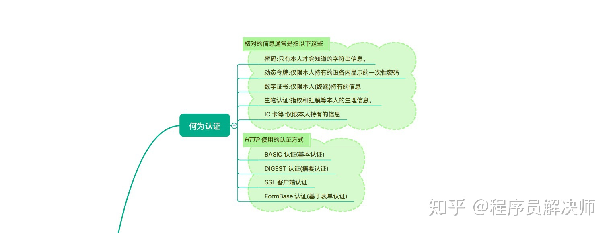
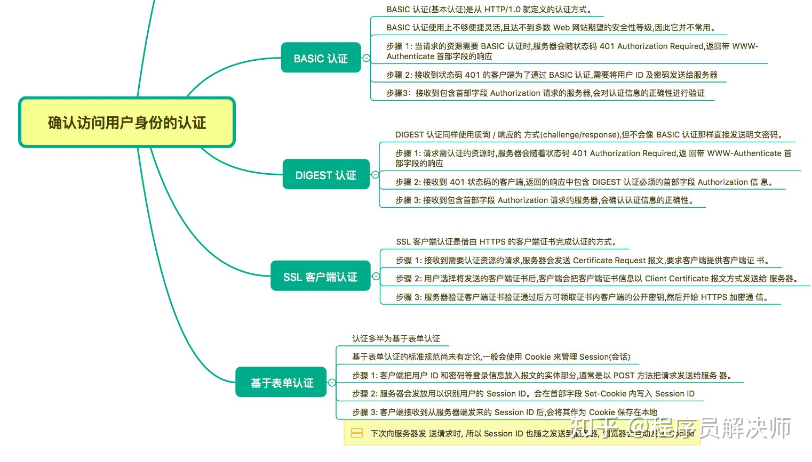

## 思维导图

> 思维导图来自： [霸天的前端笔记](https://www.zhihu.com/column/c_57862727)





## HTTP 使用的认证方式

- BASIC 认证（基本认证）

- DIGEST 认证（摘要认证）

- SSL 客户端认证

- FormBase 认证（基于表单认证）

## BASIC 认证

- HTTP/1.0 就存在的认证方式

- Base64编码:  `xiaoming:1234567` 经过 Base64 编码，变成 `Z3Vlc3Q6Z3Vlc3Q=`

  Base64 可以反编译，不是加密手段，是**明文传输**
  
- 认证步骤

  ```mermaid
  sequenceDiagram
      title: BASIC 认证
      participant Client
      participant Server
      Client->>Server: 1. 发送请求
  		Server-->>Client: 2. 401  Authorization Required  
  		Server-->>Client: 2. WWW-Authenticate: Basic realm="Input your ID and PassWord"
  	  Note right of Server: 游览器自动完成 Basic编码
  	  Client->>Server: 3. Authorization: Basic Z3Vlc3Q6Z3Vlc3Q=
      Server-->>Client: 4. 200 OK
  ```
## DIGEST 认证

使用质询 / 响应的方式，BASIC是直接发送密码，DIGEST是发送题目(质询)-生成答案(响应)

- 认证步骤
  ```mermaid
  sequenceDiagram
      title: DIGEST 认证
      participant Client
      participant Server
      Client->>Server: 1. 发送请求
  		Server-->>Client: 2. 401  Authorization Required  
  		Server-->>Client: 2. nonce="随机字符串" algorithm=MD5
  	  Note right of Server: 根据质询吗和摘要计算出的response
  	  Client->>Server: 3. response="df536789..."
    Server-->>Client: 4. 200 OK + Authentication-Info
  ```
  
- 认证等级比BASIC高，但是安全性不高，使用不便，也不是主流

## SSL 客户端认证

使用HTTPS 的 SSL客户端认证，需要在客户端安装证书（要付费），一般是银行等安全性比较高的机构使用

## 基于表单认证（常用）

- 没有共同标准规范
- 一般配合 Session 和 Cookie 管理用户认证状态
   ```mermaid
  sequenceDiagram
      Title: 表单认证
      participant Client
      participant Server
      Client->>Server: 1. 发送已登录信息(ID + PASSWORD)
  		Server-->>Client: 2. 发送Cookie: Set-Cookies:PHPSESSIONID='xxx'
  	  Note right of Server: 根据Cookie认证是否登录等信息
  	  Client->>Server: 3. 报文头中带 Cookies:PHPSESSIONID='xxx'
      Server-->>Client: 4. 200 OK
  ```

- 注意:

  为了避免 **跨站脚本攻击（XSS）**，Cookie 内加上 `httponly` 属性，不允许 JavaScript 读取。

  网站不直接保存密码，使用 密码+salt(盐) 生成的散列值作为验证的依据。

## 参考资源

1. 思维导图参考:  [霸天的前端笔记](https://www.zhihu.com/column/c_57862727)

   Github 仓库有Xmind：[Awsome-Front-End-Xmind](https://github.com/bailinlin/Awsome-Front-End-Xmind)

2. 原书参考：《图解HTTP》和 《HTTP权威指南》