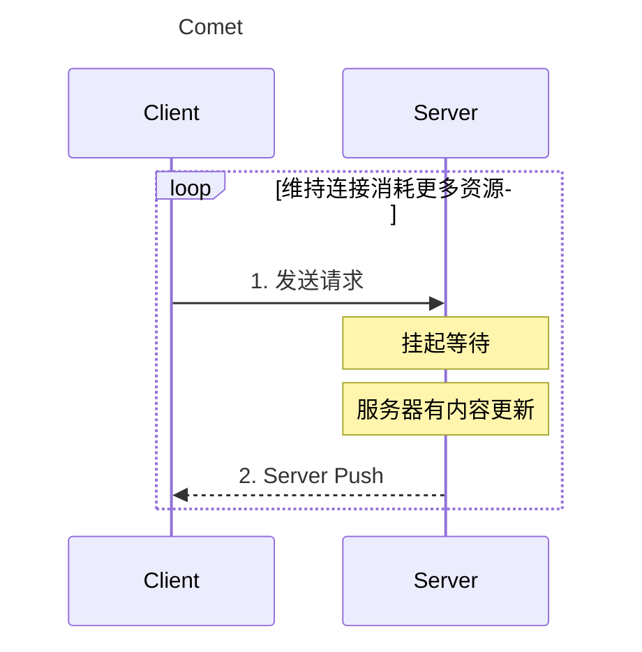
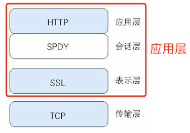
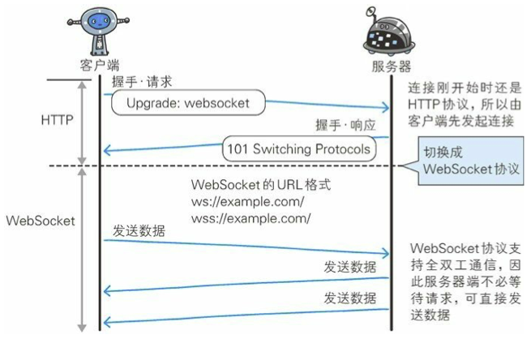
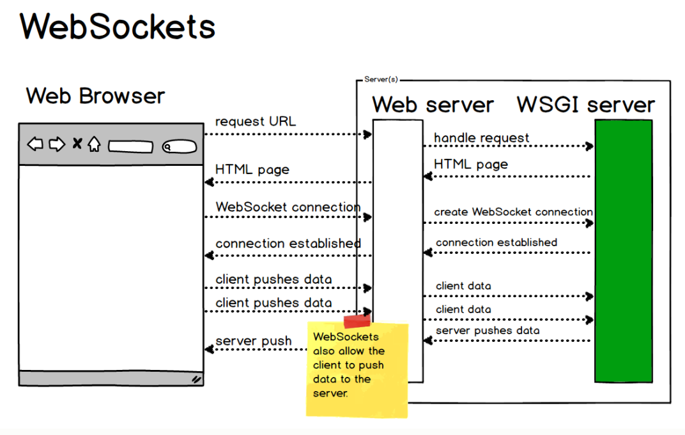

## 思维导图

> 思维导图来自： [霸天的前端笔记](https://www.zhihu.com/column/c_57862727)

](./assets/img/v2-e487660edf6fb8ad4fd3d39f7e201bf7_r.jpg)

## HTTP的瓶颈

当网站的内容发生大量更新的时候，比如微博的博客更新，网站的评论，及时新闻更新等，网站是无法及时的显示。HTTP服务要实现此功能，需要频繁的从客户端到服务端进行确认。

那么如下的HTTP标准就会成为瓶颈：

- 一条连接上只可发送一个请求
- 请求只能从客户端开始。 客户端不可以接收除响应以外的指令
- 请求 / 响应首部未经压缩就发送。 首部信息越多延迟越大
- 发送冗长的首部。 每次互相发送相同的首部造成的浪费较多
- 可任意选择数据压缩格式。 非强制压缩发送。

## 解决方法

HTTP瓶颈的三种解决方法：Ajax、Comet、SPDY、WebSocket

### Ajax的解决方法

Ajax (Asynchronous JavaScript and XML 异步JavaScript与XML技术) 是一种有效利用 JavaScript 和 DOM 的操作。Ajax 可以实现**局部 Web 页面替换加载**的异步通信手段。

> 局部加载可以减低通信量

### Comet 的解决方法

当服务端有内容更新，Comet 不会让请求等待，直接给客户端返回响应。

是一种 **延迟应答** ，模拟实现服务器端想客户端推送  **(Server Push)** 的功能

### SPDY是什么？

**目的**：解决 HTTP 的性能瓶颈，缩短 Web 页面的加载时间 (50%)

**层次结构**：

**功能**：

- 多路复用流：处理多个 HTTP 请求
- 赋予请求优先级：HTTP请求分配优先级
- 压缩 HTTP 首部
- 推送功能
- 服务器提示功能：减少发送不必要资源

**优缺点**：

- 单个域名的通信多路复用，多个域名下资源效果就很差
- SPDY是一种消除HTTP瓶颈的技术，很多网站的问题不仅仅是HTTP导致

## WebSocket

HTTP协议无法彻底解决瓶颈问题，WebSocket技术是一套新协议及API。

**特点**：

- 全双工
- 支持 JSON、XML、HTML、图片等格式
- 服务器推送
- 连接状态保持：不用每次发送首部信息，通信量也减少；连接总开销减少

**连接过程**：

通讯不是使用 HTTP数据帧，而是使用 WebSocket 数据帧。所以需要通过一次握手（Handshake）实现协议的转换。使用 `Upgrade: websocket` 实现协议的切换。

**WebSocket 全双工通路**

## WebDAV

**WebDAV**（Web-based Distributed Authoring and Versioning，基于万维网的分布式创作和版本控制）是一个可对 Web 服务器上的内容直接进行文件复制、编辑等操作的分布式文件系统。

## 参考资源

1. 思维导图参考:  [霸天的前端笔记](https://www.zhihu.com/column/c_57862727)

   Github 仓库有Xmind：[Awsome-Front-End-Xmind](https://github.com/bailinlin/Awsome-Front-End-Xmind)

2. 原书参考：《图解HTTP》和 《HTTP权威指南》

3. [websocket 协议简述](https://www.cnblogs.com/chenxinshuo/p/11980577.html)