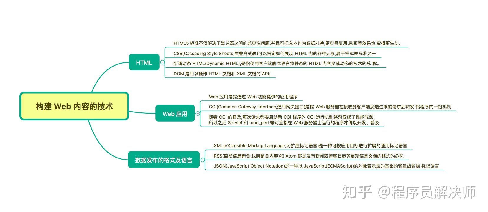
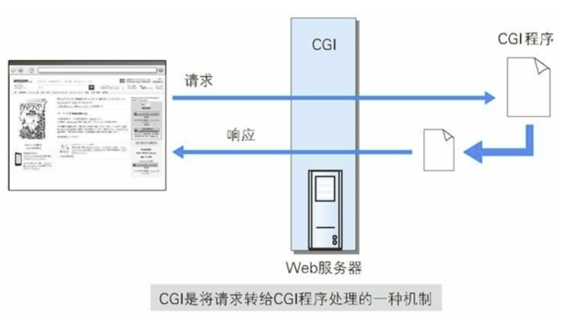
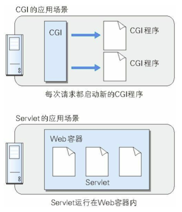

## 思维导图

> 思维导图来自： [霸天的前端笔记](https://www.zhihu.com/column/c_57862727)

## 动态HTML

动态HTML(Dynamic HTML) 是使用客户端脚本语言将静态HTML内容变成动态的技术综总和。

JavaScript + DOM 可以实现动态的操作

## Web应用

**Web应用**：Web 应用是指通过 Web 功能提供的应用程序

**CGI**：Common Gateway Interface，通用网关接口。
           CGI程序，通常是使用 Perl、PHP、Ruby、C编写的网关接口程序。

**CGI的问题**：每次请求的时候，程序都要启动一次，当访问量大的时候，CGI程序都要启动一次，Web服务器的负载比较大。

### Servlet是什么

Servlet 是一种能在服务器上创建动态内容的程序。Servlet 作为解决 CGI 问题的对抗技术。Apache 有 mod_php，微软有ASP都是对抗技术。

**Servlet 和 CGI的区别**

## 数据发布的格式及语言

- XML(可扩展标记语言):   RSS/Atom
- JSON

## 参考资源

1. 思维导图参考:  [霸天的前端笔记](https://www.zhihu.com/column/c_57862727)

   Github 仓库有Xmind：[Awsome-Front-End-Xmind](https://github.com/bailinlin/Awsome-Front-End-Xmind)

2. 原书参考：《图解HTTP》和 《HTTP权威指南》