## Ox01. TCP 与 UDP 区别？

| TCP                                              | UDP                                                     |
| ------------------------------------------------ | ------------------------------------------------------- |
| 面向连接                                         | 无连接                                                  |
| 可靠的服务（无差错，不丢失，不重复，且按序到达） | 尽最大努力交付，可靠性由应用层保证                      |
| 面向字节流（提供流量控制/重传等功能）            | 面向报文(IP+端口)                                       |
| 点对点                                           | 一对一、多对多                                          |
| 首部开销20字节                                   | 首部8字节                                               |
| 全双工的可靠信道                                 | 不可靠信道                                              |
| 拥塞控制、流量控制                               | 仅仅是对IP数据报加上端口                                |
|                                                  | 视频通信、实时通信                                      |
| FTP、Telnet、SMTP、POP3、HTTP                    | TFTP（简单文件传输协议）、SNMP（简单网络管理协议）、DNS |

## Ox02. OSI 七层模型和 TCP/IP 四层模型？

OSI七层模型和TCP/IP四层模型，每层列举2个协议

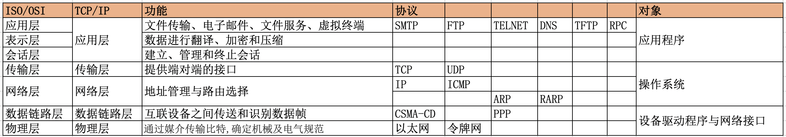

## Ox03. TCP三次握手建立连接？为什么需要3次？

### TCP的连接建立过程

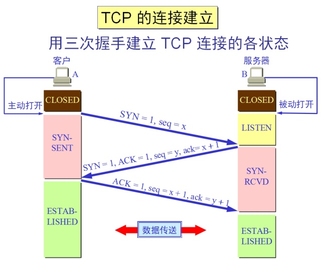

**第一次握手**：客户端发送SYN包(SYN=x)到服务器，并进入SYN_SEND状态，等待服务器确认；

**第二次握手**：服务器收到SYN包，必须确认客户的SYN（ack=x+1），同时自己也发送一个SYN包（syn=y），即SYN+ACK包，此时服务器进入SYN_RECV状态；

**第三次握手**：客户端收到服务器的SYN＋ACK包，向服务器发送确认包ACK(ack=y+1)，此包发送完毕，客户端和服务器进入ESTABLISHED状态，完成三次握手。

握手过程中传送的包里不包含数据，三次握手完毕后，客户端与服务器才正式开始传送数据。理想状态下，TCP连接一旦建立，在通信双方中的任何一方主动关闭连接之前，TCP 连接都将被一直保持下去。

### 为什么要三次握手？

> 谢希仁著《计算机网络》第四版中讲 “三次握手” 的目的是 “为了防止已失效的连接请求报文段突然又传送到了服务端，因而产生错误”。

所谓“已失效的连接请求报文段”是这样产生的，A发出的第一个连接请求报文段并没有丢失，而是在某个网络结点长时间的滞留了。于是A再重传一次连接请求，后来收到了B的确认，建立了连接。此时A，一共发送了两个连接请求的报文段，其中第一个丢失，第二个到达B。

现假定出现一种异常一块，即A发出的第一个连接请求报文段没有丢失，而是在某些网络节点长时间滞留了，以致延误到连接释放以后的某个时间才到达B。本来这是一个早已失效的报文段。但 B 收到此失效的连接请求报文段后，就误认为是 A 再次发出的一个新的连接请求。于是就向A发出确认报文段，同意建立连接。

假设不采用“三次握手”，那么只要 B 发出确认，新的连接就建立了。由于现在 A 并没有发出建立连接的请求，因此不会理睬 B 的确认，也不会向 B 发送数据。但 B 却以为新的连接已经建立，并一直等待 A 发来数据。这样，B 的很多资源就白白浪费掉了。

采用“三次握手”的办法可以防止上述现象发生。例如刚才那种情况，A 不会向 B 的确认发出确认。B 由于收不到确认，就知道 A 并没有要求建立连接。”

> 主要的目的就是防止服务端的“死锁”，因为一直等待而浪费资源。

## Ox04. TCP四次握手断开连接？为什么需要4次？

### 涉及的TCP报文段首部

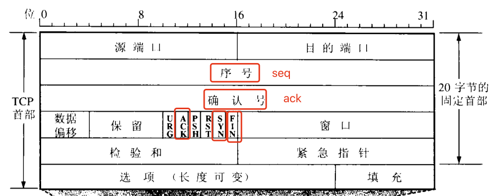

- ack: 确认号
- seq: 序号
- ACK: 标记是否确认报文段
- SYN：标记是否连接请求报文段
- FIN：标识是否终止连接报文段

### TCP 断开连接的过程

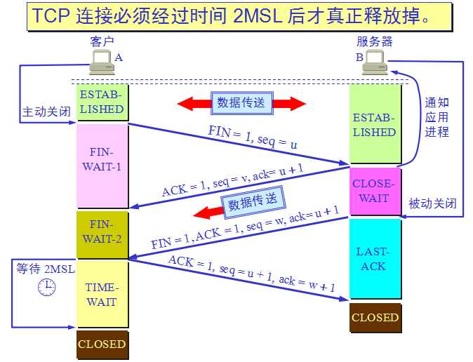

**第一次挥手**：主动关闭方发送一个FIN，用来关闭主动方到被动关闭方的数据传送，也就是主动关闭方告诉被动关闭方：我已经不会再给你发数据了，但是，此时主动关闭方还可以接受数据。

**第二次挥手**：被动关闭方收到FIN包后，发送一个ACK给对方，确认序号为收到序号+1（与SYN相同，一个FIN占用一个序号）。

**第三次挥手**：被动关闭方发送一个FIN，用来关闭被动关闭方到主动关闭方的数据传送，也就是告诉主动关闭方，我的数据也发送完了，不会再给你发数据了。

**第四次挥手**：主动关闭方收到FIN后，发送一个ACK给被动关闭方，确认序号为收到序号+1，至此，完成四次挥手。

状态的解释：

- FIN-WAIT-1：等待服务端确认关闭
- CLOSE-WAIT：半关闭状态，客服端不可以发送数据，服务端可以
- FIN-WAIT-2：等待服务端关闭
- LAST-ACK：最后等待客服端确认关闭
- TIME-WAIT：等待 2MSL的时间，进入CLOSED状态。

### 为什么需要4次握手才断开连接？

**因为TCP是全双工模式**

当A发出FIN报文段的时候，只是告知B不再发送报文，但是可以接收。当B收到A的ACK报文段的时候，就真正关闭 A to B的数据发送，此时处于半关闭状态。此时 B to A 的通道还没有关闭。所以需要四次分手才能关闭全双工的通道，上面的TCP的四次握手，可以看做是两个二次握手。

### 为什么A在TIME-WAIT转态必须等待2MSL的长度

#### 理由一：最后一次握手A to B 的ACK报文可能丢失

最后一次握手A to B 的ACK报文可能丢失，如果丢失的话，B由于迟迟收不到A到来的ACK报文，会超时重传FIN+ACK报文段，A就能在2MSL的等待关闭的时间就能收到重传的 FIN+ACK报文段。

#### 理由二：防止“已失效的连接请求报文”出现在本连接中

A在发送完最后一个ACK报文段后，再经过2MSL，就可以使本连接持续的时间内所产生的所有报文段都从网络中消失。这样可以使得下一个新的连接中不会出现这种就的连接请求报文段。

## Ox05. 连接建立后客户端出现故障怎么办？

TCP还设有一个保活计时器（keepalive timer），服务器每收到一次客户端的请求后都会重新复位这个计时器。客户端如果出现故障，服务器不能一直等下去，白白浪费资源，若计时器到了没有收到客户数据，就会发送一个探测报文段，连续10个探测报文段后无响应就关闭连接。

## Ox06. TCP如何实现可靠传输？

IP层提供的是尽最大努力服务，TCP保证了传输的可靠性。通过  **滑动窗口协议** 和 **连续ARQ协议** 保证数据是完整、按序的到达。

### 停止等待协议

停止等待：每次发送完一个分组就停止发送，直到收到对方确认。

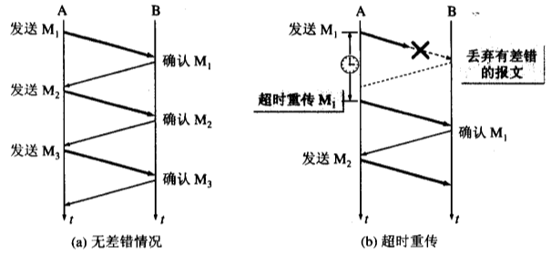

当发送方超过一段时间没有收到确认，就 **超时重传** ，重发前面的组。这样一套确认和重传机制，称之为 **自动重传请求 ARQ(Automatic Repeat request)**

### 连续ARQ协议

由于停止等待协议的效率比较低，所以可以利用滑动窗口协议，每次发送多个分组，不需要等待对方的确认。发送方每次收到一个确认，发送窗口就移动一个分组。

#### 滑动窗口协议

TCP以字节为单位的滑动窗口。

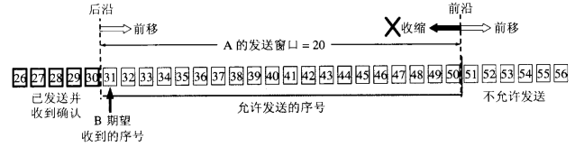

发送方可以在滑动窗口的范围内，发送字节流。

发送后窗口的变化情况：

- 不动：没有收到新的确认
- 前移：收到新的确认，前沿 **可以但不建议向后收缩**

例子：

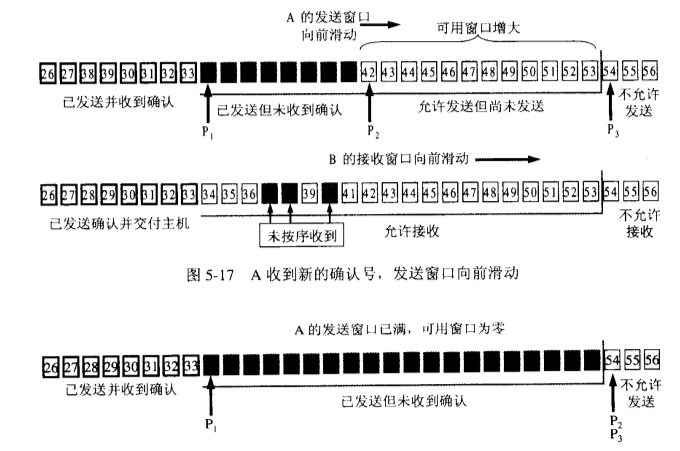

发送方和接受方都有滑动窗口

- 发送方只有在可用窗口范围内(42~53)继续发送，黑色部分是已发送但未收到确认，需要缓存这部分的数据。

- 接受方只收到 37，38，40的数据，因为不是按需收到，所以窗口不能左移。
- 最后，当A的可用发送窗口为空，不能继续发送，只能等待确认或超时重传。

### 什么是发送缓存，什么是接受缓存？有什么必要

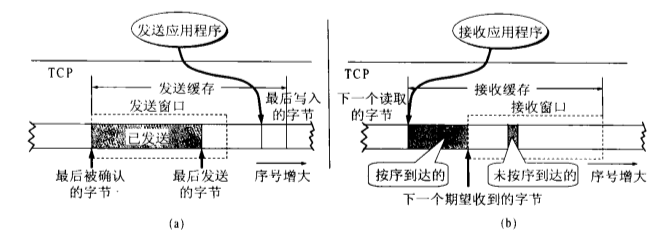

**发送缓存**：因为没有收到确认，可能发送的数据丢失了，所以需要缓存。

**接受缓存**：按序到达的缓存等待应用程序读取，未按序到达的数据等待其余数据。

## Ox07. DNS域名系统，简单描述其工作原理?

域名系统 DNS （Domain Name System） 是因特网使用的命名系统，用于将域名转换为 IP地址。

> DNS 本质上，就是一个联机分布式的数据库服务

DNS 大部分是在本地进行解析，用户的电脑就是 **DNS解析器**。解析器为了调查 IP 地址，需要向 域名服务器 进行查询。

**域名分级**：顶级域名-> 二级域名 -> 三级域名 -> 四级域名。 `www.mail.cctv.com` 为四级域名结构，.com 为顶级域名。

**域名分类& 查询过程** ：

假如域名为 `kusa.co.jp` 的主机访问网站 `www.ietf.org` 。

| 域名服务器                        | 介绍                                                         | 地址         |
| --------------------------------- | ------------------------------------------------------------ | ------------ |
| 根域名服务器 (root name server)   | 顶级域名服务器。根域名服务器是最重要的一个域名服务器，本地域名服务器首先查询该服务器 | dns.com      |
| 顶级域名服务器                    | 管理所有顶级域名                                             | dns.org      |
| 权限域名服务器                    | 管理所负责区的所有主机的IP地址映射                           | dns.ietf.org |
| 本地域名服务器(local name server) | 离用户最近，每个主机都会发送本地域名服务器，一般为**ISP（互联网接入商）** | dns.co.jp    |
| DNS解析器                         | 进行DNS查询的主机和软件，一般为**本机**                      | kusa.co.jp   |

**DNS 查询流程**：

假如域名为 `kusa.co.jp` 的主机访问网站 `www.ietf.org` 。

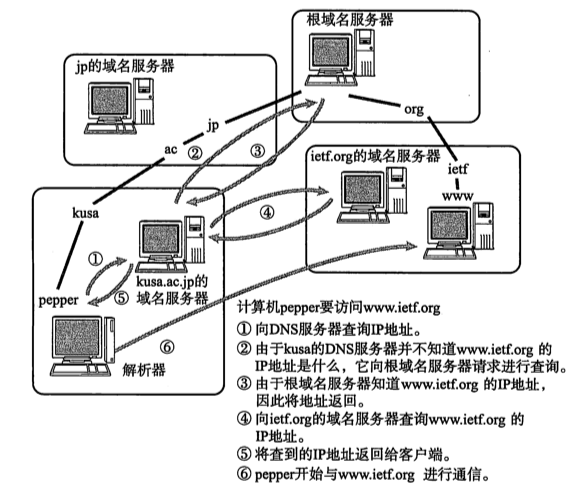

总共有多少UDP报文？ 8次

主机向本地域名服务器是 递归查询，本地域名服务器向其他服务器是迭代查询。

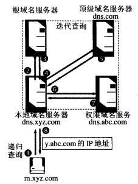

**所以共有8次 UDP**：

- 主机  ↔  本地域名服务器 【递归查询】
- 本地域名服务器  ↔  根域名服务器【迭代查询】
- 本地域名服务器  ↔  顶级域名服务器【迭代查询】
- 本地域名服务器  ↔  权限域名服务器【迭代查询】

### DNS缓存分类：

| DNS缓存分类       | 介绍                                                         |
| ----------------- | ------------------------------------------------------------ |
| 浏览器DNS缓存     | 浏览器会按照一定频率缓存DNS记录                              |
| 系统缓存          | 查找本地HOSTS文件                                            |
| 路由器DNS缓存     | 路由器的DNS缓存                                              |
| ISP的DNS缓存      | ISP(互联网服务提供商、联通电信移动) ISP有专门的DNS服务器应 |
| 域名服务器DNS缓存 | 递归查询（各级域名服务器均存在缓存）                         |

## Ox08. HTTP的长连接和短连接？

HTTP是无连接的协议，它的连接是由TCP保证的。

长连接（持久连接）：指在事务处理结束后将TCP连接保持在打开的状态，以便为未来的HTTP请求重用现存的链接。

短连接（非持久连接）：指在事务结束后关闭连接。

优缺点&应用场景：

长连接：

- **省去较多的TCP建立和关闭的操作，减少浪费，节约时间，对于频繁请求资源的客户，较适用于长连接**
- 过多的长连接，会消耗服务器大量的资源。
- 数据库连接、聊天室、实时游戏
- HTTP1.1(默认长连接)

短连接：

- 服务器管理简单，无需额外控制
- 客户端请求频繁，会浪费大量时间在TCP建立和关闭上
- 普通Web服务
- HTTP1.0

**长连接数据传输完成识别：**

- 通过 Content-Length
- 分块传输（chunked）通过最后一个 空 chunked 识别

### Websocket 协议

网站实现长连接的常用 Websocket 

**背景**：如果服务器有连续的状态变化，客户端要获知就非常麻烦。我们只能使用["轮询"](https://www.pubnub.com/blog/2014-12-01-http-long-polling/) 这种低效的方式。Websocket 不仅可以实现全双工有连接的通信，还支持主动向客户端推送信息。

**连接过程**：

- 握手阶段使用 HTTP协议
- 通过 101 Switching Protocols 进行协议的切换

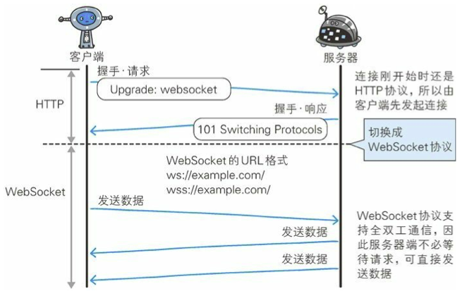

**特点**：

- 建立在 TCP 协议之上，服务器端的实现比较容易。
- 与 HTTP 协议有着良好的兼容性。默认端口也是80和443，并且握手阶段采用 HTTP 协议，因此握手时不容易屏蔽，能通过各种 HTTP 代理服务器。
- 数据格式比较轻量，性能开销小，通信高效。
- 可以发送文本，也可以发送二进制数据。
- 没有同源限制，客户端可以与任意服务器通信。
- 协议标识符是`ws`（如果加密，则为`wss(ws+ssl)`，），服务器网址就是 URL。

**参考：**

- [面试中经常问到的 长连接&短连接，你了解的多吗？](https://blog.csdn.net/qq_40884473/article/details/105852625)

- [HTTP的长连接和短连接](https://www.cnblogs.com/cswuyg/p/3653263.html)

- [WebSocket 教程](http://www.ruanyifeng.com/blog/2017/05/websocket.html)

## Ox09. ARP 的工作过程

> 参考：[奔跑吧牛客](https://www.nowcoder.com/discuss/1937)

1：首先，每个主机都会在自己的ARP缓冲区中建立一个ARP列表，以表示IP地址和MAC地址之间的对应关系。     

 2：当源主机要发送数据时，首先检查ARP列表中是否有对应IP地址的目的主机的MAC地址，如果有，则直接发送数据，如果没有，就向本网段的所有主机发送ARP数据包，该数据包包括的内容有：**源主机IP地址 ，源主机MAC地址，目的主机的IP地址** 。     

 3：当本网络的所有主机收到该ARP数据包时，首先检查数据包中的IP地址是否是自己的IP地址，如果不是，则忽略该数据包，如果是，则首先从数据包中取出源主机的IP和MAC地址写入到ARP列表中，如果已经存在，则覆盖，然后将自己的MAC地址写入ARP响应包中，告诉源主机自己是它想要找的MAC地址。          

 4：源主机收到ARP响应包后。将目的主机的IP和MAC地址写入ARP列表，并利用此信息发送数据。如果源主机一直没有收到ARP响应数据包，表示ARP查询失败。       

 广播发送ARP请求，单播发送ARP响应。  

## Ox10. RARP 是什么？有什么作用

> ARP：根据IP地址查找MAC地址  RARP：根据MAC地址查询IP地址

RARP一般用于解决小型嵌入式设备接入网络，个人电脑，一般通过DHCP自动分配获取IP地址。

**RARP工作流程**：

1. 给主机发送一个本地的RARP广播，在此广播包中，声明自己的MAC地址并且请求任何收到此请求的RARP服务器分配一个IP地址；
2. 本地网段上的RARP服务器收到此请求后，检查其RARP列表，查找该MAC地址对应的IP地址；
3. 如果存在，RARP服务器就给源主机发送一个响应数据包并将此IP地址提供给对方主机使用；
4. 如果不存在，RARP服务器对此不做任何的响应；
5. 源主机收到从RARP服务器的响应信息，就利用得到的IP地址进行通讯；如果一直没有收到RARP服务器的响应信息，表示初始化失败。

## Ox11. DHCP 协议

**DHCP（Dynamic Host Configuration Protocol ）** 动态主机配置协议：实现自动设置IP地址，统一管理IP地址分配。实现即插即用联网（plug-and-play networking）。

### DHCP的工作机制：

- 客户机请求IP；

  客户机发送 **发现报文（DHCPDISCOVER）**

  源IP：0.0.0.0 【因为没有自己的IP地址】

  目的IP：255.255.255.255【表示此主机为 DHCP客户机】

- 服务器响应；

  服务器发送 **提供报文（DHCPOFFER）**

  

### DHCP会不会需要设置很多？DHCP 代理是什么？：

在小型网络（家庭）中DHCP服务器一般由路由器充当。在大型网络（校园网）的时候，DHCP 服务器不会设置太多，网络中使用 **DHCP 中继代理(replay agent)** 转发DHCP 请求。

  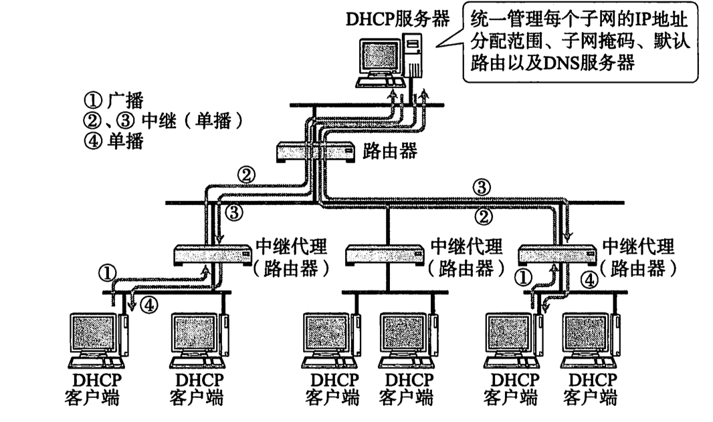

### 如何检查/保证分配的IP地址是可用的？

- DHCP服务器：分配IP地址前发送ICMP回送请求包，确认没有返回应答

- DHCP客户端：针对DHCP分配的IP地址，发送ARP包，确认没有返回应答

## Ox12.说说静态路由和动态路由有什么区别

- **静态路由：** 路由表类目人工添加；
- **动态路由：** 路由表类目动态生成。

### 路由选择协议

常见的路由选择协议有：RIP协议、OSPF协议。

**RIP协议** ：底层是贝尔曼福特算法，它选择路由的度量标准（metric)是跳数，最大跳数是15跳，如果大于15跳，它就会丢弃数据包。

**OSPF协议** ：Open Shortest Path First开放式最短路径优先，底层是迪杰斯特拉算法，是链路状态路由选择协议，它选择路由的度量标准是带宽，延迟。

## Ox13. HTTP中Get和Post的区别是什么？

- Get是从服务器上获取数据，Post是向服务器传送数据。

- Get是把参数数据队列加到提交表单的Action属性所指向的URL中，Get参数通过url传递，Post放在request body中。

- Get传送的数据量小，不能大于2KB；Post传送的数据量较大，一般被默认为不受限制。

- 根据HTTP规范，GET用于信息获取，而且应该是安全的和幂等的。

  **安全**：意味着该操作用于获取信息而非修改信息。换句话说，GET请求一般不应产生副作用。就是说，它仅仅是获取资源信息，就像数据库查询一样，不会修改，增加数据，不会影响资源的状态。

  **幂等**：对同一URL的多个请求应该返回同样的结果。
  
- Get请求只能进行url编码，而post支持多种编码方式。

- Get请求会浏览器主动缓存，Post 请求不能缓存。

## Ox14. IP 地址子网划分

### IP地址概念

- 网络地址：网络地址代表着整个网络。**网络地址的主机号为全0**。

  如 192.168.0.4/24 的网络地址为 192.168.0.0

- 广播地址/直接广播地址：发送广播消息的时候使用此地址该网络内所有主机都收到。**网络地址的主机号为全1**。

  如 192.168.0.4/24 的网络地址为 192.168.0.255

- 组播地址：D类地址

### IP 地址分类

| 类别    | 范围                                                         | 作用     |
| ------- | ------------------------------------------------------------ | -------- |
| A类地址 | 以0开头，  第一个字节范围：1~127（1.0.0.0 - 127.255.255.255） | 基本类   |
| B类地址 | 以10开头，  第一个字节范围：128~191（128.0.0.0 - 191.255.255.255） | 基本类   |
| C类地址 | 以110开头， 第一个字节范围：192~223（192.0.0.0 - 223.255.255.255） | 基本类   |
| D类地址 | 以1110开头，第一个字节范围：224~239（224.0.0.0 - 239.255.255.255） | 组播地址 |
| E类地址 | 以1111开头，第一个字节范围：240~255（240.0.0.0~255.255.255.255） | 保留     |

### 特殊地址:

- **255.255.255.255**: 受限广播地址，只能在本地广播，不可以跨网段广播。

- **0.0.0.0**：当本机没有IP，获取IP地址时使用。一般用于RARP，BOOTP和DHCP协议中发送IP请求分组。

- **回环地址**：127.0.0.0/8被用作回环地址，回环地址表示本机的地址，常用于对本机的测试，用的最多的是127.0.0.1。

- **私有地址**：

  A类私有地址：10.0.0.0/8，范围是：10.0.0.0~10.255.255.255
  B类私有地址：172.16.0.0/12，范围是：172.16.0.0~172.31.255.255
  C类私有地址：192.168.0.0/16，范围是：192.168.0.0~192.168.255.255

### 子网掩码及网络划分

目前除了使用NAT在企业内部利用保留地址自行分配以外，通常都对一个高类别的IP地址进行再划分，以形成多个子网，提供给不同规模的用户群使用。

### 子网掩码的计算

IP地址与子网掩码相与得到网络号：

ip : 192.168.2.110
& Submask : 255.255.255.0
网络号  ：192.168.2  .0

## 协议梳理

| 协议     | 介绍                                                         | 备注         |
| -------- | ------------------------------------------------------------ | ------------ |
| FTP      | 文件传输协议，使用21端口                                     | TCP          |
| Telnet   | 远程登陆的协议，使用23端口，用户可以以自己的身份远程连接到计算机上 | TCP          |
| SMTP     | 邮件传送协议，用于发送邮件。服务器开放的是25号端口           | TCP          |
| POP3     | 它是和SMTP对应，POP3用于接收邮件。POP3协议所用的是110端口    | TCP          |
| HTTP     | 超文本传输协议                                               | TCP          |
| DNS      | 域名解析服务，将域名地址转换为IP地址。DNS用的是53号端口      | UDP          |
| SNMP     | 简单网络管理协议，使用161号端口，是用来管理网络设备的。由于网络设备很多，无连接的服务就体现出其优势。 | UDP          |
| TFTP     | 简单文件传输协议，该协议在熟知端口69上使用UDP服务。          | UDP          |
| ICMP协议 | 因特网控制报文协议。它是TCP/IP协议族的一个子协议，用于在IP主机、路由器之间传递控制消息。 |              |
| DHCP协议 | 动态主机配置协议，是一种让系统得以连接到网络上，并获取所需要的配置参数手段。 |              |
| NAT协议  | 网络地址转换属接入广域网(WAN)技术，是一种将私有（保留）地址转化为合法IP地址的转换技术 | 解决IPV4耗尽 |

## 参考

1. [计算机网络之面试常考](https://www.nowcoder.com/discuss/1937) 

2. [[Network\] 计算机网络基础知识总结](https://www.cnblogs.com/maybe2030/p/4781555.html)  【推荐】

3. [网络面经总结](https://www.cnblogs.com/Mc-God/p/9470437.html) 【大全】