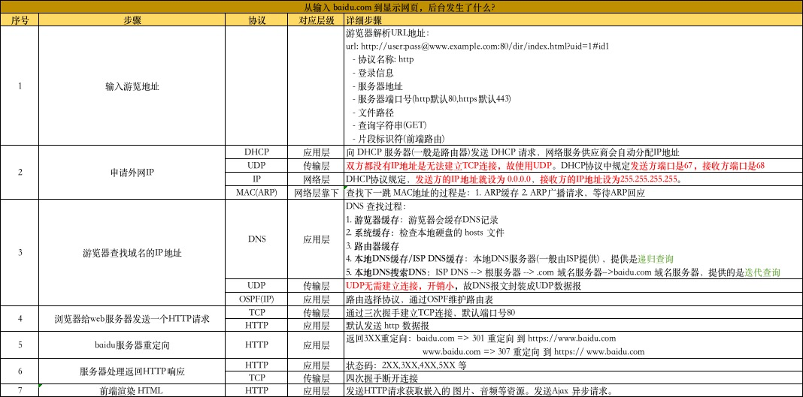

经过资料的查询，大概整理了如下的表格

## 详细的流程

## 简单的回答

## 参考资料：

1. [从输入URL到页面展示到底发生了什么](https://mp.weixin.qq.com/s?__biz=MzAxNDMwMTMwMw==&mid=2247488981&idx=1&sn=cddfdfe93d7d90d463b3f81cae56ecd2&chksm=9b9434cdace3bddbcc19fe6740f0e6a1ac33b5f29f7bdb9f1f7861b761065fff85c4778af562&scene=0&key=daf5926c99d6695fd0757e2ef09b95c76f593895f3fa1827bcf1b6894f31e6d71e50ed8c537cffd881ff0081b069c62df345a6d61b99802e6fcd83e98dc6a57c65af10d81dbb0c1be13406d18cd8664a&ascene=14&uin=MjEzOTc2MjYzMQ%3D%3D&devicetype=Windows+10&version=62060728&lang=zh_CN&pass_ticket=YVYQuTg%2FBMTYHxQounqWoDVtpcueDJYHWXh4IkXedW%2BAo2tjpP7U4AaduEI%2BEga%2F)
2.  [当你输入一个网址的时候，实际会发生什么?](https://www.cnblogs.com/wenanry/archive/2010/02/25/1673368.html)
3. [what-really-happens-when-you-navigate-to-a-url](http://igoro.com/archive/what-really-happens-when-you-navigate-to-a-url/)

4. [Web浏览过程中涉及到的协议](https://blog.csdn.net/Mary19920410/article/details/60133609)

